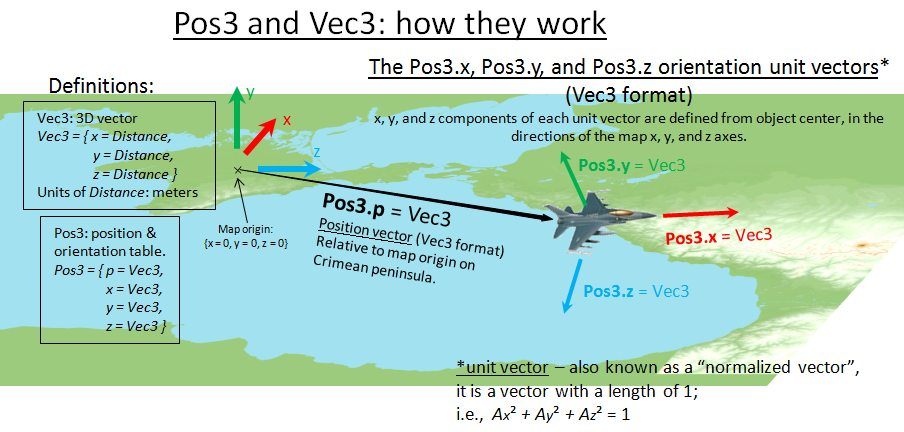

# DCS: World Scripting Engine
-----------------------------

*   Part 1
*   Intro
*   Lua environment
*   Game objects
*   Symbol structure
*   Basic terms and types
*   Singletons
*   Part 2
*   Classes
*   Object
*   CoalitionObject
*   Weapon
*   Unit
*   Airbase
*   StaticObject
*   SceneryObject
*   Group
*   Controller
*   Detection
*   Spot


#### Intro

The scripting engine is a new feature of DCS since DCS: A-10C. The engine provides mission designer with access to game world and game objects using scripts. It's possible to change object properties, control object behavior and read object properties. The scripting engine was developed primary to be used for A.I. control. This is the way to create more sophisticated behavior of A.I. units than it possible using ME GUI because you can take in account more factors.

**Note:** The engine was initially developed for debug purposes. It was not tested properly, not tweaked, not reworked or extended due the requests of the community, so now it may contain bugs and disadvantages.

**The document is actual for DCS: World 1.2.6.**

-------------------

#### Lua environment

The scripting engine uses the [Lua](http://www.Lua.org/) language. Mission scripts run in a special, isolated Lua environment - the Mission Scripting Environment. There are two ways to run a Lua script:

**AI Tasking System**

1\. "Script" command of A.I. Tasking System (available in a group's advanced waypoint actions and in triggered actions). If "Script" command is a waypoint action, then the command will run when the group reaches the waypoint the command is associated with. If "Script" command is a triggered action, then the command will run when the triggered action is called via the "AI TASK" trigger action.

2\. "Script File" command of A.I. Tasking System (available in a group's advanced waypoint actions and in triggered actions). If "Script File" command is a waypoint action, then the command file will run when the group reaches the waypoint the script is associated with. If "Script File" command is a triggered action, then the command file will run when the triggered action is called via the "AI TASK" trigger action.

3\. "CONDITION (LUA EXPRESSION)" for condition / stop condition for any type of action of the A.I. Tasking System. Such code should return boolean value or nil.

**Triggers**

1\. "DO SCRIPT" trigger action.

2\. "DO SCRIPT FILE" trigger action.

3\. "EXPRESSTION" trigger condition. Such code must return boolean value of nil.

**Other**

1\. Initialization script.

or

2\. Initialization script file.

This script runs before spawn of first unit and before run of first trigger action. Script of script file can be selected, no both ways at the same time.

----------------------------------

#### Game objects

There are several types of objects which the mission designer has access to. Some of these objects consist of a single instance (singleton), while several types may have multiple instances.

**env**. The simulator environment. Singleton. Provides access to program environment.

**timer**. The model timer of the simulator. Singleton. Provides current model time and current mission time.

**land**. The terrain. Singleton. Contains several functions for terrain analyzing.

**atmosphere**. The atmosphere. Singleton. Wind an other parameters.

**world**. The game world. Singleton.

**coalition**. The game coalitions: red, blue and neutral. Provides access to properties of coalitions such as bullseye, reference points and services.

**country**. The game countries. Provides only country list.

**trigger**. The trigger system. Singleton. Provides access to some trigger actions, trigger zones and user flags.

**coord**. Provides access to functions that convert between LO, MGRS, and latitude/longitude coordinate systems.

**radio**. Provides access to game radio system.

**missionCommands**. Provides access to mission commands in "F10. Other" menu.

**AI**. Provides constants used in _Controller_ functions.

**Object**. The base category for static objects and units. _Object_ is a static rigid body that has position (coordinate and orientation), category, type and descriptor.

**CoalitionObject**. Objects that belongs to a coalition and country. Intermediate class. This is the base class for static objects, airbases and unit and weapon.

**Airbase**. Airdrome, helipad or ship that acts as a base for aircraft.

**StaticObject**. It's possible to create new static objects during the mission and destroy them.

**Weapon**. Weapon utilities.

**Unit**. Active game object: aircraft, vehicle or ship. A Unit has several properties: name, coalition, state, type, number (in group), health, velocity, etc.

Units are always stored in a group.

A Unit may or may not have its own "Controller" object. If the unit does not have its own controller, then the unit is always under control of its group's controller, and thus, it is not possible to control the unit independently from its group.

For example, each aircraft has its own controller. An airborne group has its own controller too. This makes it possible to assign a task to any unit in the group, or to the whole group at once.

Naval and ground units do not have a controller for each unit, and only have a group controller, so you can only set a task to a whole naval or ground group.

**Group**. A group of units (ground, airborne and naval). Provides access to a group's properties, and to the units that a group consists of.

**Controller**. An instance of A.I. for a single unit or of a whole group. The mission designer may set a task to a controller, order a controller to perform a command, or change AI behavior options.

-----------------------------

#### Symbol structure

Simulator exports some functions and constants to the Mission Scripting Environment. All symbols are grouped in tables.  

#### Class emulation

Simulator has many entities which behave like an objects and classes in terms of object-oriented languages. To make manipulation with such objects easer "class-object" relations were emulated in the Lua environement with metatables. This framework is located in _./Scripts/Common/LuaClass.Lua._

Lua-"class" is a table that has following structure:

```bash
 Class = { 
   static = { 
     staticFunc1 = function(...) 
     ... 
     end, 
   ... 
     staticFuncN = function(...) 
     ... 
     end 
   }, 
   member = { 
     memberFunc1 = function(objectID, ...) 
     ... 
     end, 
   ... 
     memberFuncM = function(objectID, ...) 
     ... 
     end 
   },
   className\_ = "ClassName", 
   parentClass\_ = Class 
 }
```

_static_

*   Table with "static" functions. These functions have no object id as a parameter.

_member_

*   Table with "member" functions. These functions always have object id as a first parameter.

_className\__

*   String class name.

_parentClass\__

*   Reference to parent class table.

Lua-"object" is a table that has following structure:

```bash
 ObjectName = { 
   id\_ = ... 
 }
```
_id\__

*   Object identifier. Its type depends on class. Member functions of Lua-"classes" has this identifier as a first argument.

Objects of the same class have set the same metatable - the class table.

The framework allows single inheritance, but doesn't allow multiple inheritance. Table of base class must be value of _parentClass\__ field table of derivative class.

_LuaClass_ table must be assigned as a metatable to all Lua-"classes". _LuaClass_ does all the job when user uses Lua-"classes" and Lua-"objects". _LuaClass.\_\_index_ metamethod is a function that looks for function that user want to call in Lua-"class" that the Lua-"object" belongs to or in base "classes" and calls the function.

_LuaClass_ has also useful several functions those may be called any Lua-"class".
```bash
 _function LuaClass.createFor(class, id\_)_ 
```
creates and returns Lua-"object" that belongs to class Lua-"class" and has identifier _id\__. No new entity created. The function just creates and initializies Lua-"object" table for existing entity.
```bash
 _function LuaClass.create(class, ...)_ 
```
uses _class.static.create_ function to create new entity and then uses _LuaClass.createFor_ to create Lua-"object" class for just created entity.
```bash
 _function LuaClass.cast(class, object)_ 
```
casts object to object of another class. Downcast must be unsafe if user will cast the object to class that object not realy belongs to.
```bash
 _function class(tbl, parent)_ 
```
declares table _tbl_ as a Lua-"class" and as a derrivative class of a _parent_ if _parent_ is not nil

#### How does it works

Simulator exported some tables with functions and constants to the Mission Scripting Environment and then runs _./Scripts/MissionScripting.lua_ script do declare these tables a Lua-"classes".

However you may declare your own classes. To do it you must:

*   Create table and complete the table same way it shown here.
*   Declare the table as a class (and if you want as a derivative class). To do this call _class_ function.

---------------------------

#### Basic terms and types

**Enum**

Enumeration types are given as

_EnumType = enum EnumTable_

This means the _EnumType_ is enum type. Constants are stored in _EnumTable_ table. It doesn't matter what is the real type of the _EnumType_. Mission developer must NEVER operate constant values! Only constant names must be used!

**Array**

Given as

_ArrayType = array of ElementType_

This means _ArrayType_ is table that contains _ElementType_
```bash
 ArrayType = {
   \[1\] = ElementType,
   \[2\] = ElementType,
   ...
   \[N\] = ElementType
 }
```
**Map**

Given as

_MapType = map KeyType, ElementType_

This means _MapType_ is table that contains _ElementType_ each with key of type _KeyType_.
```bash
 MapType = {
   \[KeyType\] = ElementType,
   \[KeyType\] = ElementType,
   ...
   \[KeyType\] = ElementType
 }
```
  
**Time**

_Time = number_

_Time_ is given in seconds.

Model time is the time that drives the simulation. Model time may be stopped, accelerated and decelerated relative real time.

Mission time is a model time plus time of the mission start.

**Distance**

_Distance = number_

_Distance_ is given in meters.

**Angle**

_Angle = number_

_Angle_ is given in radians.

_Azimuth = Angle_

Azimuth is an angle of rotation around world axis y counter-clockwise.

**Mass**

_Mass = number_

_Mass_ is given in kilograms.

**Coordinate system**

DCS world has 3-dimensional coordinate system. DCS ground is an infinite plain.

Main axes:

*   x is directed to the north
*   z is directed to the east
*   y is directed up

**Vectors**

_Vec3_ type is a 3D-vector. It is a table that has following format:
```bash
 Vec3 = { 
   x = Distance, 
   y = Distance, 
   z = Distance 
 } 
```
_Vec2_ is a 2D-vector for the ground plane as a reference plane.
```bash
 Vec2 = { 
   x = Distance, 
   y = Distance 
 } 
```
```bash
 Vec2.x = Vec3.x
 Vec2.y = Vec3.z
```

**Another coordinate systems**

Geographic coordinates are represented by latitude/longitude pair given in degrees.

_GeoCoord = number_

Latitude positive direction is North. Longitude positive direction is East.

[MGRS](http://en.wikipedia.org/wiki/Military_grid_reference_system) coordinates are represented by table:
```bash
 MGRS = {
   UTMZone = string,
   MGRSDigraph = string,
   Easting = number,
   Northing = number
 }
```
_MGRS.UTMZone_ identifies MGRS zone.

_MGRS.MGRSDigraph_ is a pair of letters - identifier of 100x100 km square in the zone.

_MGRS.Easting_/_MGRS.Northing_ pair determines location within the 100x100 km square. Precision depends on how many digits used. no digits - precision level 100 km 1 digits - precision level 10 km 2 digits - precision level 1 km 3 digits - precision level 100 m 4 digits - precision level 10 m

**Orientation**

Object orientation is represented by 3x3 orthogonal row-major matrix. Matrix rows are orthogonal normalized vectors (also called unit vectors):

*   x is the Vec3 unit vector that points in the direction of the object's front
*   y is the Vec3 unit vector that points in the direction of the object's top
*   z is the Vec3 unit vector that points in the direction of the object's right side
```bash
 Orientation = { 
   x = Vec3, 
   y = Vec3, 
   z = Vec3 
 }
```
A "normalized vector", also known as a "unit vector", is a vector that has a length equal to 1.

As an example, an object that was oriented pointing due east, with its top pointed straight up, would have the following set of orientation vectors:
```bash
Orientation = {
   x = { x = 0, y = 0, z = 1},
   y = { x = 0, y = 1, z = 0},
   z = { x = -1, y = 0, z = 0}
}
```
**Position**

Position is a composite structure. It consists of both coordinate vector and orientation matrix.

Position3 (also known as "Pos3" for short) is a table that has following format:
```bash
 Position3 = {   p = Vec3,
                 x = Vec3,
                 y = Vec3,
                 z = Vec3 }
```
An illustration of the Pos3 structure and how it relates to simulation objects is shown below.



  

**Box3**
```bash
 Box3 = {
   min = Vec3,
   max = Vec3
 }
```
3-dimensional box.

**TypeName**

_TypeName = string_

Each object belongs to a type. Object type is a named couple of properties those independent of mission and common for all units of the same type. Name of unit type is a string. Samples of unit type: "Su-27", "KAMAZ" and "M2 Bradley".

**AttributeName**

_AttributeName = string_

Each object type may have attributes.

Attributes are enlisted in ./Scripts/Database/db\_attributes.Lua.

To know what attributes the object type has, look for the unit type script in sub-directories _planes/_, _helicopter/s_, _vehicles_, _navy/_ of _./Scripts/Database/_ directory.

**Desc**
```bash
 Desc = {
   typeName = TypeName, --type name
   displayName = string, --localized display name
   attributes = array of AttributeName --object type attributes
 }
```
Each object type has its own descriptor. Descriptor is a table that contains common information about all objects of this type, including common and specific (depending on object category and type) parameters. All descriptors inherit _Desc_.

---------------------

#### Singletons

Singletons represent the types of object those have only single instance. Here are the usual Lua tables.

#### env
```bash
 _function env.info(string message, bool showMessageBox = false)_
 _function env.warning(string message, bool showMessageBox = false)_
 _function env.error(string message, bool showMessageBox = false)_
```
add message to simulator log with caption "INFO", "WARNING" or "ERROR". Message box is optional.

_message_

*   message string to add to log.

_showMessageBox_

*   If the parameter is true Message Box will appear. Optional.
```bash
 _function env.setErrorMessageBoxEnabled(boolean on)_
```
enables/disables appearance of message box each time lua error occurs.

_on_

*   if true message box appearance is enabled

#### timer
```bash
 _Time function timer.getTime()_ 
```
returns model time in seconds.
```bash
 _Time function timer.getAbsTime()_ 
```
returns mission time in seconds.
```bash
 _Time function timer.getTime0()_ 
```
returns mission start time
```bash
 _Time function FunctionToCall(any argument, Time time)_
   _..._
   _return ..._
 _end_
```
must return model time of next call or nil.
```bash
 _FunctionId = number_
 ```

is a numeric identifier of scheduled _FunctionToCall_.
```bash
 _FunctionId function timer.scheduleFunction(FunctionToCall functionToCall, any functionArgument, Time time)_ 
```
schedules function to call at desired model time.

_functionToCall_

*   Lua-function to call. Must have prototype of _FunctionToCall_.

_functionArgument_

*   Function argument of any type to pass to _functionToCall_.

_time_

*   Model time of the function call.
```bash
 _function timer.setFunctionTime(FunctionId functionId, Time time)_
```
re-schedules function to call at another model time.

_functionToCall_

*   Lua-function to call. Must have prototype of _FunctionToCall_.

_time_

*   Model time of the function call.
```bash
 _function timer.removeFunction(FunctionId functionId)_
```

removes the function from schedule.

_functionId_

*   Function identifier to remove from schedule

#### land
```bash
 land.SurfaceType = {
   LAND,
   SHALLOW\_WATER,
   WATER,
   ROAD,
   RUNWAY
 }
```
enum contains identifiers of surface types.
```bash
 _boolean function land.isVisible(Vec3 from, Vec3 to)_ 
```
returns true if there is LOS between point _from_ and point _to_. Function verifies only obstruction due the terrain and don't takes in account objects (units, static and terrain objects).
```bash
 _Distance function land.getHeight(Vec2 point)_ 
```
returns altitude MSL of the _point_.

_point_

*   point on the ground.
```bash
 _Vec3 function land.getIP(Vec3 from, Vec3 direction, Distance maxDistance)_ 
```
returns point where the ray intersects the terrain. If no intersection found the function will return nil.

_from_

*   Ray vertex.

_direction_

*   Ray normalized direction.

_maxDistance_

*   Maximal search distance from ray vertex.
```bash
 _array of Vec3 function land.profile(Vec3 from, Vec3 to)_ 
```
returns table of vectors those are form profile of the terrain between point _from_ and point _to_.

Only x and z components of both vectors matters. The first _Vec3_ in the result table is equal to vector _from_, the last vector in the result table is equal to vector _to_.
```bash
 _enum land.SurfaceType function land.getSurfaceType(Vec2 point)_ 
```
returns surface type at the given point.

_point_

*   Point on the land.

#### atmosphere
```bash
 _Vec3 atmosphere.getWind(Vec3 point)_
```
returns wind velocity at the given point. No turbulence.

_point_

*   Point in the air.
```bash
 _Vec3 atmosphere.getWindWithTurbulence(Vec3 point)_
```
returns wind velocity at the given point. With turbulence.

_point_

*   Point in the air.

#### world
```bash
 world.event = {
   S\_EVENT\_SHOT,
   S\_EVENT\_HIT,
   S\_EVENT\_TAKEOFF,
   S\_EVENT\_LAND,
   S\_EVENT\_CRASH,
   S\_EVENT\_EJECTION,
   S\_EVENT\_REFUELING,
   S\_EVENT\_DEAD,
   S\_EVENT\_PILOT\_DEAD,
   S\_EVENT\_BASE\_CAPTURED,
   S\_EVENT\_MISSION\_START, \-- currently can not be caught in script due to happens before script load
   S\_EVENT\_MISSION\_END,
   S\_EVENT\_TOOK\_CONTROL,
   S\_EVENT\_REFUELING\_STOP,
   S\_EVENT\_BIRTH,
   S\_EVENT\_HUMAN\_FAILURE,
   S\_EVENT\_ENGINE\_STARTUP,
   S\_EVENT\_ENGINE\_SHUTDOWN,
   S\_EVENT\_PLAYER\_ENTER\_UNIT,
   S\_EVENT\_PLAYER\_LEAVE\_UNIT,
   S\_EVENT\_PLAYER\_COMMENT,
   S\_EVENT\_SHOOTING\_START,
   S\_EVENT\_SHOOTING\_END,
   S\_EVENT\_MARK\_ADDED,
   S\_EVENT\_MARK\_CHANGE,
   S\_EVENT\_MARK\_REMOVED,
   S\_EVENT\_KILL,
   S\_EVENT\_SCORE,
   S\_EVENT\_UNIT\_LOST,
   S\_EVENT\_LANDING\_AFTER\_EJECTION,
   S\_EVENT\_PARATROOPER\_LENDING,
   S\_EVENT\_DISCARD\_CHAIR\_AFTER\_EJECTION,
   S\_EVENT\_WEAPON\_ADD,
   S\_EVENT\_TRIGGER\_ZONE,
   S\_EVENT\_LANDING\_QUALITY\_MARK,
   S\_EVENT\_BDA,
   S\_EVENT\_AI\_ABORT\_MISSION,
   S\_EVENT\_DAYNIGHT,
   S\_EVENT\_FLIGHT\_TIME,
   S\_EVENT\_PLAYER\_SELF\_KILL\_PILOT,
   S\_EVENT\_PLAYER\_CAPTURE\_AIRFIELD,
   S\_EVENT\_EMERGENCY\_LANDING,  \-- useful event to handle when a bot ditches, and "group dead" condition can't be met 
 }
```
enum contains identifiers of simulator events.
```bash
 world.BirthPlace = {
   wsBirthPlace\_Air,
   wsBirthPlace\_RunWay,
   wsBirthPlace\_Park,
   wsBirthPlace\_Heliport\_Hot,
   wsBirthPlace\_Heliport\_Cold,
 }
```
enum contains identifiers of birth place.
```bash
 Event = {
   id = enum world.event,
   time = Time,
   initiator = Unit,
   target = Unit,
   place = Unit,
   subPlace = enum world.BirthPlace,
   weapon = Weapon
 }
```

table represents a simulator event. Not all the parameters are valid for any event.
```bash
 function EventHandler(Event event)
   ...
 end
```
is a handler of simulator event.
```bash
 _function world.addEventHandler(EventHandler handler)_
```
adds event handler.

_handler_

*   event handler. Must have prototype of _EventHandler_.
```bash
 _function world.removeEventHandler(EventHandler handler)_
```
removes event handler.

**Note:** event handling will be moved from ./Scripts/World/EventHandlers.lua to the code. Function _world.addEventHandler_ will support argument passing.

_handler_

*   event handler. Must have form of _EventHandler_.
```bash
 _Unit function Unit world.getPlayer()_
```
returns _Unit_ player's aircraft.
```bash
 _function array of Airbase world.getAirbases()_
```
returns list of airbases
```bash
 world.VolumeType = {
   SEGMENT,
   BOX,
   SPHERE,
   PYRAMID
 }
```
enum contains types of volume to search.
```bash
 Volume = {
   id = enum world.VolumeType,
   params = {
     ...    
   }
 }
```
Table that contains information about the given volume.

_id_

*   Identifies volume type.

_params_

*   Table that contains parameters of the volume. Content is depended on volume type.
```bash
 VolumeSegment = {
   id = world.VolumeType.SEGMENT,
   params = {
     from = Vec3,
     to = Vec3
   }
 }
```
Represents 3D-segment.

_from_

*   Point where is the segment started.

_to_

*   Point where is the segment finished.
```bash
 VolumeBox = {
   id = world.VolumeType.BOX,
   params = {
     min = Vec3,
     max = Vec3
   }
 }
```
Represents 3D-box.

_min_

*   Coordinates of western-southern-lower vertex of the box.

_max_

*   Coordinates of eastern-northern-upper vertex of the box.
```bash
 VolumeSphere = {
   id = world.VolumeType.SPHERE,
   params = {
     point = Vec3,
     radius = Distance
   }
 }
```
Represents sphere.

_point_

*   Coordinates of the sphere center.

_radius_

*   Radius of the sphere.
```bash
 VolumePyramid = {
   id = world.VolumeType.PYRAMID,
   params = {
     pos = Position3,
     length = Distance,
     halfAngleHor = Angle,
     halfAngleVer = Angle
   }
 }
```
Represents camera FOV or oriented pyramid.

_pos_

*   Position of the pyramid.

_length_

*   Maximal distance from the pyramid vertex to an object.

_halfAngleHor_

*   Horizontal half angle.

_halfAngleVer_

*   Vertical half angle.
```bash
 ObjectSearchHandler = function(Object object, any data)
   ...
   return boolean
 end
```
Function to be called for each found object. Returns true to continue search and false to stop it.
```bash
 _function array of Airbase world.searchObjects(\[array of enum Object.Category\] or \[Object.Category\] objectCategory, Volume volume, ObjectSearchHandler handler, any data)_
```
searches objects of the given categories in the given volume and calls _handler_ function for each found object with _data_ as 2nd argument.

_objectCategory_

*   Category or categories of objects to search.

_volume_

*   Volume to search.

_handler_

*   Function to call.

_data_

*   Data to pass to _handler_ as 2nd argument.

#### world.getPersistenceData(name)

Read persistence data identified by name.  
Returns Lua-value stored in this miz/sav by a given name or nil if no value found.  
**Name** MUST ONLY consist of the following characters: \[a-zA-Z0-9\_ -\], that is _Latin alphabet, numbers, space, underscore and dash_.

This API is to be used in the initialization part of the script.  
During mission it will always return data stored in the original miz/sav, data is updated ONLY after simulation finishes.  
See world.setPersistenceHandler(name, handler) for further details.

**Important note about the API**: the use of names as keys for persistent data allows scripts to read data from any name they know. This is intentional to support cases where some scripts and frameworks might support data saved by other scripts and frameworks. Defining common names and data formats left up to framework authors.

Storage format:  
Inside .miz/.sav the persistence data is stored as persistence/<name>.json files.

#### world.setPersistenceHandler(name, handler)

Registers a handler for generating persistent data when saving simulation state.  
**Name** MUST conform to the same restriction described above.  
**Handler** MUST be a Lua-function which takes no arguments and returns persistent data as a _Lua-value (boolean, number, string, table)_.  
The returned value must be _JSON-serializable_.

The handler will be called every time the simulation state is being saved.  
Note, that **saving a state during mission run-time DOES NOT update the values returned by world.getPersistenceData(name)** - these will continue to return persistence data as it was on the start of this simulation.  
This is done in order to avoid state saving to influence the simulation.

**Important note about the API**: the use of names as keys for persistent data allows scripts to read data from any name they know. This is intentional to support cases where some scripts and frameworks might support data saved by other scripts and frameworks. Defining common names and data formats left up to framework authors.

Storage format:  
Inside .miz/.sav the persistence data is stored as persistence/<name>.json files.

#### world.setPersistencePassthrough( array\_of\_strings )

Sets the list of persistence data names which will pass through to the next mission loaded by the LOAD MISSION trigger action. The persistence records from the current mission with the listed names will override the ones coming from the saved state of the next mission. NOTE: This list applies to the missions loaded using LOAD MISSION trigger action only. All other methods to load a mission will clear the pass-through list.

Example:

*   world.setPersistencePassthrough( {'data1', 'data2'} )

makes data1 and data2 persistence data to pass through to the next mission, which will be run with the LOAD MISSION trigger action.

#### world.weather

**Fog**
```bash
world.weather.getFogThickness()
```
Get the current fog thickness in meters. Returns **zero** if fog is not present.
```bash
world.weather.setFogThickness(thickness)
```
Instantly sets fog thickness in meters. The current fog animation is always discarded. Set **zero** to disable the fog.  
Actual limits: **\[100; 5000\]**

**Fog thickness cannot be greater than the clouds lower bound, it will be clamped.**
```bash
world.weather.getFogVisibilityDistance()
```
Get the current maximum visibility distance in meters. Returns **zero** if fog is not present.
```bash
world.weather.setFogVisibilityDistance(visibility)
```
Instantly sets the maximum visibility distance of fog at sea level when looking at the horizon. In meters. The current fog animation is always discarded. Set **zero** to disable the fog.  
Actual limits: **\[100, 100;000\]**
```bash
world.weather.setFogAnimation(...)
```
Sets fog animation keys. Time is set in seconds and relative to the current simulation time, where time=0 is the current moment. Time must be increasing. Previous animation is always discarded despite the data being correct.
```bash
world.weather.setFogAnimation(
{
     -- relative time (seconds), visibility (meters), thickness (meters)
     {5, 1000, 500},
     ...,
     {50, 2000, 400},
})
```
If the first key time is greater than **zero**, the animation begins from the current fog state. Set time=0 in the first key to immediately apply fog changes. Set thickness=0 or visibility=0 to remove the fog in a particular key.
```bash
world.weather.setFogAnimation()
```
and
```bash
world.weather.setFogAnimation({})
```
are valid calls to discard the current animation.

**Fog thickness cannot be greater than the clouds lower bound, it will be clamped.**

#### coalition
```bash
 coalition.side = {
   NEUTRAL,
   RED,
   BLUE
 }
```
enum contains side identifiers.
```bash
 coalition.service = {
   ATC,
   AWACS,
   TANKER,
   FAC
 }
```
enum stores identifiers of coalition services.
```bash
 _enum coalition.side function coalition.getCountryCoalition(enum country.id country)_

returns coalition of the given country.

_country_

*   country identifier.
```bash
 _Vec3 function coalition.getMainRefPoint(enum coalition.side coalition)_
```
returns main reference point (bullseye).

_coalition_

*   coalition identifier.
```bash
 RefPoint = {
   callsign = number,
   type = number,
   point = Vec3
 }
```
table is a reference point (used by JTAC AI for example).
```bash
 _array of RefPoint function coalition.getRefPoints(enum coalition.side coalition)_
```
returns coalition reference points.

_coalition_

*   coalition identifier
```bash
 _function coalition.addRefPoint(enum coalition.side coalition, RefPoint refPoint)_
```
adds reference point to the coalition's list.

_coalition_

*   coalition identifier.

_refPoint_

*   reference point to add.
```bash
 _array of Unit function coalition.getServiceProviders(enum coalition.side coalition, enum country.service serviceId)_
```
returns list of units which are the coalition service providers

_coalition_

*   coalition identifier
```bash
 _array of Unit function coalition.getPlayers(enum coalition.side coalition)_
```
_coalition_

*   coalition identifier

returns list of units controlled by players (local and remote)

_serviceId_

*   coalition service identifier
```bash
 _array of Airbase function coalition.getAirbases(enum coalition.side coalition)_
```
returns list of airbases owned by the coalition

_coalition_

*   coalition identifier
```bash
 _array of Unit function coalition.getGroups(enum coalition.side coalition, enum Group.Category groupCategory or nil)_
```
returns list of groups belong to the coalition. It returns all groups or groups of specified type.

_coalition_

*   coalition identifier

_groupCategory_

*   group category. If nil the function will return list of groups of all categories.
```bash
 _array of StaticObject function coalition.getStaticObjects(enum coalition.side coalition)_
```
returns list of static objects belong to the coalition.

_coalition_

*   coalition identifier
```bash
 _Group function coalition.addGroup(enum country.id country, enum Group.Category groupCategory, table groupData)_
```
_country_

*   country identifier

_groupCategory_

*   group category.

_groupData_

*   table with group data. The table has the same format groups have in a mission file.

**Note:**

*   **Coalition of a group is determined by its country**

*   **If another group has the same name new group has, that group will be destroyed and new group will take its mission ID.**

*   **If another units has the same name an unit of new group has, that unit will be destroyed and the unit of new group will take its mission ID.**

*   **If new group contains player's aircraft current unit that is under player's control will be destroyed.**

*   **Groups with client aircraft are not allowed.**

*   **If group mission ID are not specified or busy, simulator will assign mission ID automatically.**
*   **If unit mission ID are not specified or busy, simulator will assign mission ID = unit name.**

 _Group function coalition.addStaticObject(enum country.id country, table staticObjectData)_

_country_

*   country identifier

_staticObjectData_

*   table with static object data. The table has the same format static objects have in a mission file.

**Note:**

*   **Coalition of a static object is determined by its country**

*   **If another static object has the same name new static object has, that static object will be destroyed and new static object will take its mission ID.**

*   **If static object mission ID is not specified or busy, simulator will assign new mission ID automatically.**

#### country
```bash
 country.id = {
   RUSSIA,
   UKRAINE,
   USA,
   TURKEY,
   UK,
   FRANCE,
   GERMANY,
   CANADA,
   SPAIN,
   THE\_NETHERLANDS,
   BELGIUM,
   NORWAY,
   DENMARK,
   ISRAEL,
   GEORGIA,
   INSURGENTS,
   ABKHAZIA,
   SOUTH\_OSETIA,
   ITALY
 }
```
enum contains country identifiers.

#### trigger
```bash
 trigger.smokeColor = {
   Green,
   Red,
   White,
   Orange,
   Blue
 }
```
enum contains identifiers of smoke color.
```bash
 trigger.flareColor = {
   Green,
   Red,
   White,
   Yellow
 }
```
enum contains identifiers of signal flare color.
```bash
 _number function trigger.misc.getUserFlag(string userFlagName)_
```
returns value of the user flag.

_userFlagName_

*   User flag name.
```bash
 TriggerZone = {
   point = Vec3,
   radius = Distance
 }
```
is a trigger zone.
```bash
 _TriggerZone function trigger.misc.getZone(string triggerZoneName)_ 
```
returns trigger zone.

_triggerZoneName_

*   Trigger zone name.
```bash
 _function trigger.action.userEvent(...)_
```
pushes a notification for onGameEvent() hooks with:

*   onGameEvent('user\_event', ...)

where ... is a list of 0-N scalar lua values of type boolean, number or string.

Example

*   trigger.action.userEvent(1, true, "text")

will invoke onGameEvent() hooks with

*   onGameEvent('user\_event', 1, true, "text")
```bash
 _function trigger.action.outSound(string soundFile)_
```
plays sound file to all players.

_soundFile_

*   name of sound file stored in the mission archive (miz).
```bash
 _function trigger.action.setUserFlag(string userFlagName, boolean or number userFlagValue)_
```
sets new value of the user flag

_userFlagName_

*   User flag name.

_userFlagValue_

*   New value of the user flag. Numeric or boolean (0 or 1).
```bash
 _function trigger.action.outSound(string soundFile)_
```
plays sound file to all players.

_soundFile_

*   name of sound file stored in the mission archive (miz).
```bash
 _function trigger.action.outSoundForCoalition(enum coalition.side coalition, string soundFile)_
```
plays sound file to all players on a specific coalition.

_coalition_

*   coalition identifier.

_soundFile_

*   name of sound file stored in the mission archive (miz).
```bash
 _function trigger.action.outSoundForCountry(enum country.id country, string soundFile)_
```
plays sound file to all players on a specific country.

_country_

*   country identifier.

_soundFile_

*   name of sound file stored in the mission archive (miz).
```bash
 _function trigger.action.outSoundForGroup(GroupId groupId, string soundFile)_
```
plays sound file to players in a specific group.

_groupId_

*   group identifier.

_soundFile_

*   name of sound file stored in the mission archive (miz).
```bash
 _function trigger.action.outText(string text, Time delay)_
```
output text to screen to all players.

_text_

*   text to show.

_delay_

*   text delay.
```bash
 _function trigger.action.outTextForCoalition(enum coalition.side coalition, string text, Time delay)_
```
output text to screen to all players on a specific coalition.

_coalition_

*   coalition identifier.

_text_

*   text to show.

_delay_

*   text delay.
```bash
 _function trigger.action.outTextForCountry(enum country.id country, string text, Time delay)_
```
output text to screen to all players on a specific country.

_country_

*   country identifier.

_text_

*   text to show.

_delay_

*   text delay.
```bash
 _function trigger.action.outTextForGroup(GroupId groupId, string text, Time delay)_
```
output text to screen to all players in a specific unit group.

_groupId_

*   group identifier.

_text_

*   text to show.

_delay_

*   text delay.
```bash
 _function trigger.action.explosion(Vec3 point, number power)_
```
creates an explosion.

_point_

*   point in 3D space.

_power_

*   explosion power.
```bash
 _function trigger.action.smoke(Vec3 point, enum trigger.smokeColor color)_
```
creates a smoke marker.

_point_

*   point in 3D space.

_color_

*   color of the smoke.
```bash
 _function trigger.action.illuminationBomb(Vec3 point)_
```
creates illumination bomb at the point.

_point_

*   point where the illumination bomb will appear.
```bash
 _trigger.action.signalFlare(Vec3 point, enum trigger.flareColor color, Azimuth azimuth)_
```
launches signal flare from the point.

_point_

*   point the signal flare will be launched from.

_color_

*   signal flare color.

_azimuth_

*   signal flare flight direction.
```bash
 _function trigger.action.addOtherCommand(string name, string userFlagName, number userFlagValue = 1)_ 
```
adds command to "F10. Other" menu of the Radio Command Panel. The command will set the flag _userFlagName_ to _userFlagValue_.

Calls _missionCommands.addCommand()_.

_name_

*   menu command name.

_userFlagName_

*   user flag name.

_userFlagValue_

*   user flag value. By default equals to 1.
```bash
 _function trigger.action.removeOtherCommand(string name)_
```
removes menu item.

Calls _missionCommands.removeItem()_.
```bash
 _function trigger.action.addOtherCommandForCoalition(enum coalition.id coalition, string name, string userFlagName, number userFlagValue = 1)_ 
```
adds command to "F10. Other" menu of the Radio Command Panel for the coalition. The command will set the flag _userFlagName_ to _userFlagValue_.

Calls _missionCommands.addCommandForCoalition()_.

_coalition_

*   coalition the command to add for

_name_

*   menu command name.

_userFlagName_

*   user flag name.

_userFlagValue_

*   user flag value. By default equals to 1.
```bash
 _function trigger.action.removeOtherCommandForCoalition(enum coalition.id coalition, string name)_
```
removes the item for the coalition.

Calls _missionCommands.removeItemForCoalition()_.

_coalition_

*   coalition the command to remove for

_name_

*   name of the menu item to remove
```bash
 _function trigger.action.addOtherCommandForGroup(GroupId groupId, string name, string userFlagName, number userFlagValue = 1)_ 
```
adds command to "F10. Other" menu of the Radio Command Panel for the group. The command will set the flag _userFlagName_ to _userFlagValue_.

Calls _missionCommands.addCommandForGroup()_

_groupId_

*   id of the group to add the command for

_name_

*   menu command name.

_userFlagName_

*   user flag name.

_userFlagValue_

*   user flag value. By default equals to 1.
```bash
 _function trigger.action.removeOtherCommandForGroup(GroupId groupId, string name)_
```
removes the item for the group.

Calls _missionCommands.removeItemForGroup()_

_groupId_

*   id of the group to remove the command for

_name_

*   name of the menu item to remove
```bash
 _function trigger.action.radioTransmission(string fileName, Vec3 point, enum radio.modulation modulation, boolean loop, number frequency, number power)_ 
```
transmits audio file to broadcast.

_fileName_

*   name of audio file. The file must be packed into the mission archive (miz).

_point_

*   position of the transmitter

_modulation_

*   modulation of the transmission

_loop_

*   indicates if the transmission is looped or not

_frequency_

*   transmitter frequency in Hz

_power_

*   transmitter power in Watts

  
```bash
 _function trigger.action.setAITask(Group group, number taskIndex)_
```
sets triggered task for the group.

_group_

*   the group to set the task for.

_taskIndex_

*   index of triggered task.
```bash
 _function trigger.action.pushAITask(Group group, number taskIndex)_
```
pushes triggered task for the group.

_group_

*   the group to push the task for.

_taskIndex_

*   index of triggered task.
```bash
 _function trigger.action.activateGroup(Group group)_
```
activates the group. Calls _group:activate()_.

_group_

*   group to activate.
```bash
 _function trigger.action.deactivateGroup(Group group)_
```
deactivates the group. Calls _group:destroy()_.

_group_

*   group to deactivate.
```bash
 _function trigger.action.setGroupAIOn(Group group)_
```
sets the controller of the group on. Calls _group:getController():setOnOff(true)_.

_group_

*   group to set the controller on.
```bash
 _function trigger.action.setGroupAIOff(Group group)_
```
sets the controller of the group off. Calls _group:getController():setOnOff(false)_.

_group_

*   group to set the controller off.
```bash
 _function trigger.action.groupStopMoving(Group group)_
```
orders the group to stop moving. Sets _StopRoute_ command with _value = true_ to the group controller.

_group_

*   group order to stop moving.
```bash
 _function trigger.action.groupContinueMoving(Group group)_
```
orders the group to continue moving. Sets _StopRoute_ command with _value = false_ to the group controller.

_group_

*   group order to continue moving.

#### coord
```bash
 _Vec3 coord.LLtoLO(GeoCoord latitude, GeoCoord longitude, Distance altitude = 0)_
```
returns point converted from latitude/longitude to _Vec3_.

_latitude, longitude_

*   latitude and longitude.

_altitude_

*   point altitude. _Vec3.y = altitude_. Optional parameter, equals to 0 by default.
```bash
 _GeoCoord, GeoCoord, Distance function coord.LOtoLL(Vec3 point)_
```
returns point converted to latitude/longitude/altitude from Vec3. Altitude is equals to _point.y_.

_point_

*   point to convert. Only x and z matters.
```bash
 _MGRS function coord.LLtoMGRS(GeoCoord latitude, GeoCoord longitude)_
```
converts latitude/longitude to MGRS.

_latitude, longitude_

*   latitude and longitude.
```bash
 _GeoCoord, GeoCoord function coord.MGRStoLL(MGRS mgrs)_
 ```

converts point from MGRS to latitude/longitude

_mgrs_

*   MGRS-coordinates of the point.

#### radio
```bash
 radio.modulation = {
   AM,
   FM
 }
```
enum contains identifiers of modulation types.

#### missionCommands

Provides access to the mission commands available for players in "F10. Other" menu in the communication menu.
```bash
 _Path_
```
contains menu item path.

**Note: Path is the inner type. Do not construct variables of this type, use values returned from _addCommand_... and _addSubMenu_ instead**!
```bash
 _Time function CommandFunction(any argument)_
   _..._
 _end_
```
*   function to be called by selecting the menu item

**All**
```bash
 _Path missionCommands.addCommand(string name, Path or nil path, CommandFunction сommandFunction, any argument)_
```
adds the command for all

_name_

*   command caption

_path_

*   path to the submenu the command must be inserted to. If nil the command will be inserted into root menu.

_commandFunction_

*   function to call

_argument_

*   argument to pass to the function
```bash
 _Path missionCommands.addSubMenu(string name, Path or nil path)_
```
adds the submenu for all

_name_

*   command caption

_path_

*   path to the submenu the command must be inserted to. If nil the command will be inserted into root menu.
```bash
 _Path missionCommands.removeItem(Path or nil path)_
```
removes the item for all

_path_

*   path to the item (command or submenu) to remove. If nil all items will be removed from the root menu.

**Coalition**
```bash
 _Path missionCommands.addCommandForCoalition(enum coalition.side coalition, string name, Path or nil path, CommandFunction сommandFunction, any argument)_
```
adds the command for the coalition

_coalition_

*   the coalition to add the command for

_name_

*   command caption

_path_

*   path to the submenu the command must be inserted to. If nil the command will be inserted into root menu.

_commandFunction_

*   function to call

_argument_

*   argument to pass to the function
```bash
 _Path missionCommands.addSubMenuForCoalition(enum coalition.side coalition, string name, Path or nil path)_
```
adds the submenu the coalition

_coalition_

*   the coalition to add the submenu for

_name_

*   command caption

_path_

*   path to the submenu the command must be inserted to. If nil the command will be inserted into root menu.
```bash
 _Path missionCommands.removeItemForCoalition(enum coalition.side coalition, Path or nil path)_
```
removes the item for the coalition

_coalition_

*   the coalition to remove the item for

_path_

*   path to the item (command or submenu) to remove. If nil all items will be removed from the root menu.

**Group**
```bash
 _Path missionCommands.addCommandForGroup(GroupId groupId, string name, Path or nil path, CommandFunction сommandFunction, any argument)_
```
adds the command for the group. Any type of groups available: airborne, ground, naval.

_groupId_

*   id of the group to add the command for

_name_

*   command caption

_path_

*   path to the submenu the command must be inserted to. If nil the command will be inserted into root menu.

_commandFunction_

*   function to call

_argument_

*   argument to pass to the function
```bash
 _Path missionCommands.addSubMenuForGroup(GroupId groupId, string name, Path or nil path)_
```
adds submenu to menu for the coalition

_groupId_

*   id of the group to add the submenu for

_name_

*   command caption

_path_

*   path to the submenu the command must be inserted to. If nil the command will be inserted into root menu.
```bash
 _Path missionCommands.removeItemForGroup(GroupId groupId, Path or nil path)_
```
removes the item for the coalition

_groupId_

*   id of the group to remove the item for

_coalition_

*   the coalition to remove the item for

_path_

*   path to the item (command or submenu) to remove. If nil all items will be removed from the root menu.

#### AI

Contains constants used in _Controller_ functions.
```bash
 AI.Skill = {
   AVERAGE,
   GOOD,
   HIGH,
   EXCELLENT,
   PLAYER,
   CLIENT
 }
```
enum contains unit skill values.
```bash
 AI = {
   Task = {
     ...
   },
   Option = {
     ...
   }
 }
```
_Task_ subtable contains constants used in tasks, _Option_ subtable contains behavior option constants and their values.
```bash
 AI.Task.WeaponExpend = {
   ONE,
   TWO,
   FOUR,
   QUARTER,
   HALF,
   ALL
 }
```
enum contains identifiers of weapon expend modes.
```bash
 AI.Task.OrbitPattern = {
   CIRCLE,
   RACE\_TRACK
 }
```
enum contains identifiers of orbit patterns.
```bash
 AI.Task.Designation = {
   NO,
   AUTO,
   WP,
   IR\_POINTER,
   LASER
 }
```
enum contains identifiers of target designation modes.
```bash
 AI.Task.WaypointType = {
   TAKEOFF,
   TAKEOFF\_PARKING,
   TURNING\_POINT,
   LAND,
 }
```
enum contains identifiers of waypoint types.
```bash
 AI.Task.TurnMethod = {
   FLY\_OVER\_POINT,
   FIN\_POINT
 }
```
enum contains identifiers of turn methods
```bash
 AI.Task.AltitudeType = {
   BARO,
   RADIO
 }
```
enum contains identifiers of altitude types
```bash
 AI.Task.VehicleFormation = {
   OFF\_ROAD,
   ON\_ROAD,
   RANK,
   CONE,
   DIAMOND,
   VEE,
   ECHELON\_LEFT,
   ECHELON\_RIGHT
 }
```
enum contains identifiers of vehicle formations
```bash
  AI.Option = {
     Air = {
        id = enum ???,
        val = map ???, enum ???
     },
     Ground = {
        id = enum ???,
        val = map ???, enum ???
     },
     Naval = {
        id = enum ???,
        val = map ???, enum ???
     }
  }
```
table contains identifiers of behavior options (_id_) and their values (_val_) as enums for airborne, ground and naval units / groups.

_id_

*   enum that contains options identifiers.

_val_

*   map that contains identifiers of option values for each option. Keys match names of option identifiers.

-------------------

#### Classes

Classes represent the types of object those may have multiple instances.

--------------------

#### Object

Represents an object with body, unique name, category and type. Non-final class.

**Types**

_Object.Category_ enum that stores object categories.
```bash
 Object.Category = {
   UNIT,
   WEAPON,
   STATIC,
   SCENERY,
   BASE
 }
```
**Structures**
```bash
 Object.Desc = extends Desc {
   life = number, --initial life level
   box = Box3 --bounding box of collision geometry
 }
```
object descriptor. Each object belongs to a type and each such type has its own descriptor. Descriptor format depends on object category, but always extends _Object.Desc_.

**Member functions**
```bash
 _boolean function Object.isExist(Object self)_
```
return if the object exist.
```bash
 _function Object.destroy(Object self)_
```
destroys the object without making damage to it and generation any event. The object just disappear. For now it is impossible to destroy remote objects.
```bash
 _enum Object.Category Object.getCategory(Object self)_
```
returns category of the object.
```bash
 _TypeName Object.getTypeName(Object self)_
```
returns type name of the object.
```bash
 _Object.Desc Object.getDesc(Object self)_
```
returns object descriptor.
```bash
 _boolean function Object.hasAttribute(Unit self, AttributeName attributeName)_ 
 ```

_attributeName_

*   Attribute name to check.

returns true if the object belongs to the _category_.
```bash
 _string Object.getName(Object self)_
```
returns name of the object. This is the name that is assigned to the object in the Mission Editor.
```bash
 _Vec3 function Object.getPoint(Object self)_ 
```
returns object coordinates for current time.
```bash
 _Position3 function Object.getPosition(Object self)_ 
```
returns object position for current time.
```bash
 _Vec3 function Object.getVelocity(Object self)_ 
```
returns the unit's velocity vector.
```bash
 _boolean function Object.inAir(Object self)_ 
```
returns true if the unit is in air.

-------------------------

#### CoalitionObject

Represents all _Objects_ those may belong to a coalition: units, airbases, static objects, weapon. Extends _Object_. Non-final class.

**Member functions**
```bash
 _enum coalition.side CoalitionObject.getCoalition(CoalitionObject self)_
```
returns coalition of the object.
```bash
 _enum country.id CoalitionObject.getCountry(CoalitionObject self)_
```
returns object country.

-----------------------

#### Weapon

Represents a weapon unit: shell, rocket, missile and bomb. Extends _CoalitionObject_. Final class.

**Types**

_Weapon.flag_ enum stores weapon flags. Some of them are combination of another flags.
```bash
 Weapon.flag = {
   LGB, 
   TvGB, 
   SNSGB, 
   
   HEBomb, 
   Penetrator, 
   NapalmBomb, 
   FAEBomb, 
   ClusterBomb, 
   Dispencer, 
   CandleBomb, 
   ParachuteBomb, 
   
   GuidedBomb = LGB + TvGB + SNSGB, 
   AnyUnguidedBomb = HEBomb + Penetrator + NapalmBomb + FAEBomb + ClusterBomb + Dispencer + CandleBomb + ParachuteBomb, 
   AnyBomb = GuidedBomb + AnyUnguidedBomb, 
   
   LightRocket, 
   MarkerRocket, 
   CandleRocket, 
   HeavyRocket, 
   
   AnyRocket = LightRocket + HeavyRocket + MarkerRocket + CandleRocket, 
   
   AntiRadarMissile, 
   AntiShipMissile, 
   AntiTankMissile, 
   FireAndForgetASM, 
   LaserASM, 
   TeleASM, 
   CruiseMissile, 
   
   GuidedASM = LaserASM + TeleASM, 
   TacticASM = GuidedASM + FireAndForgetASM, 
   AnyASM = AntiRadarMissile + AntiShipMissile + AntiTankMissile + FireAndForgetASM + GuidedASM + CruiseMissile, 
   
   SRAAM, 
   MRAAM, 
   LRAAM, 
   
   IR\_AAM, 
   SAR\_AAM, 
   AR\_AAM, 
   
   AnyAAM = IR\_AAM + SAR\_AAM + AR\_AAM + SRAAM + MRAAM + LRAAM, 
   
   AnyMissile = AnyASM + AnyAAM,   
   AnyAutonomousMissile = IR\_AAM + AntiRadarMissile + AntiShipMissile + FireAndForgetASM + CruiseMissile,
   
   GUN\_POD, 
   BuiltInCannon, 
   
   Cannons = GUN\_POD + BuiltInCannon, 
   
   AnyAGWeapon = BuiltInCannon + GUN\_POD + AnyBomb + AnyRocket + AnyASM, 
   AnyAAWeapon = BuiltInCannon + GUN\_POD + AnyAAM, 
   
   UnguidedWeapon = Cannons + BuiltInCannon + GUN\_POD + AnyUnguidedBomb + AnyRocket, 
   GuidedWeapon = GuidedBomb + AnyASM + AnyAAM, 
   
   AnyWeapon = AnyBomb + AnyRocket + AnyMissile + Cannons, 
   
   MarkerWeapon = MarkerRocket + CandleRocket + CandleBomb, 
   ArmWeapon = AnyWeapon - MarkerWeapon
 }
```
_Weapon.Category_ enum that stores weapon categories.
```bash
 Weapon.Category = {
   SHELL,
   MISSILE,
   ROCKET,
   BOMB
 }
```
_Weapon.GuidanceType_ enum that stores guidance methods. Available only for guided weapon (_Weapon.Category.MISSILE_ and some _Weapon.Category.BOMB_).
```bash
 Weapon.GuidanceType = {
   INS,
   IR,
   RADAR\_ACTIVE,
   RADAR\_SEMI\_ACTIVE,
   RADAR\_PASSIVE,
   TV,
   LASER,
   TELE
 }
```
_Weapon.MissileCategory_ enum that stores missile category. Available only for missiles (_Weapon.Category.MISSILE_).
```bash
 Weapon.MissileCategory = {
   AAM,
   SAM,
   BM,
   ANTI\_SHIP,
   CRUISE,
   OTHER
 }
```
_Weapon.WarheadType_ enum that stores warhead types.
```bash
 Weapon.WarheadType = {
   AP,
   HE,
   SHAPED\_EXPLOSIVE
 }
```
**Structures**
```bash
 Weapon.Desc = extends Object.Desc {
   category = enum Weapon.Category,
   warhead = {
     type = enum Weapon.WarheadType,
     mass = Mass,
     caliber = Distance,
     explosiveMass = Mass or nil, --for HE and AP(+HE) warheads only
     shapedExplosiveMass = Mass or nil, --for shaped explosive warheads only
     shapedExplosiveArmorThickness = Distance or nil ----for shaped explosive warheads only
   }
 }
```
weapon descriptor. This is common part of descriptor for any weapon. Some fields are actual only for HE and AP+HE warheads, some fields are actual only for shaped explosive warheads. Descriptor format depended on weapon category.
```bash
 Weapon.DescMissile = extends Weapon.Desc {    
   guidance = enum Weapon.GuidanceType,
   rangeMin = Distance,
   rangeMaxAltMin = Distance,
   rangeMaxAltMax = Distance,
   altMin = Distance,
   altMax = Distance,
   Nmax = number,
   fuseDist = Distance
 }
```
missile descriptor.
```bash
 Weapon.DescRocket = extends Weapon.Desc {
   distMin = Distance,
   distMax = Distance
 }
```
rocket descriptor.
```bash
 Weapon.DescBomb = extends Weapon.Desc {    
   guidance = enum Weapon.GuidanceType,
   altMin = Distance,
   altMax = Distance,
 }
```
bomb descriptor.

**Member functions**
```bash
 _Unit Weapon.getLauncher(Weapon self)_
```
returns the unit that launched the weapon
```bash
 _Object Weapon.getTarget(Weapon self)_
```
returns target of the guided weapon. Unguided weapons and guided weapon that is targeted at the point on the ground will return nil.
```bash
 _Weapon.Desc Weapon.getDesc(Weapon self)_
```
returns weapon descriptor. Descriptor type depends on weapon category.

----------------------

#### Unit

Represents units: airplanes, helicopters, vehicles, ships and armed ground structures. Extends _CoalitionObject_. Final class. _Units_ exist in groups.

**Types**
```bash
 _Unit.ID_
```
Identifier of an unit. It assigned to an unit by the Mission Editor automatically.
```bash
 _Unit.Category_
```
enum that stores unit categories
```bash
 Unit.Category = {
   AIRPLANE,
   HELICOPTER,
   GROUND\_UNIT,
   SHIP,
   STRUCTURE
 }
```
 _Unit.RefuelingSystem_

enum that stores aircraft refueling system types.
```bash
 Unit.RefuelingSystem = {
   BOOM\_AND\_RECEPTACLE,
   PROBE\_AND\_DROGUE
 }
```
 _Unit.SensorType_

enum that stores sensor types.
```bash
 Unit.SensorType = {
   OPTIC,
   RADAR,
   IRST,
   RWR
 }
```
 _Unit.OpticType_

enum that stores types of optic sensors.
```bash
 Unit.OpticType = {
   TV, --TV-sensor
   LLTV, --Low-level TV-sensor
   IR --Infra-Red optic sensor
 }
```
 _Unit.RadarType_

enum that stores radar types.
```bash
 Unit.RadarType = {
   AS, --air search radar
   SS --surface/land search radar
 }
```
**Structures**
```bash
 Unit.Desc extends Object.Desc = {
   category = enum Unit.Category,
   massEmpty = Mass, --mass of empty unit
   speedMax = Distance / Time, --maximal velocity
 }
```
an unit descriptor. This is common part of unit descriptor. Its format depends on unit category.
```bash
 Unit.DescAircraft extends Unit.Desc = {
   fuelMassMax = Mass, --maximal inner fuel mass
   range = Distance, --operational range
   Hmax = Distance, --ceiling
   VyMax = Distance / Time, --maximal climb rate
   NyMin = number, --minimal safe acceleration
   NyMax = number, --maximal safe acceleration
   tankerType = enum Unit.RefuelingSystem, --refueling system type
 }
```
an aircraft descriptor.
```bash
 Unit.DescAirplane extends Unit.DescAircraft = {
   speedMax0 = Distance / Time, --maximal TAS at ground level
   speedMax10K = Distance / Time --maximal TAS at altitude of 10 km
 }
```
an airplane descriptor.
```bash
 Unit.DescHelicopter extends Unit.DescAircraft = {
   HmaxStat = Distance, --static ceiling
 }
```
a helicopter descriptor.
```bash
 Unit.DescVehicle extends Unit.Desc = {
   maxSlopeAngle = Angle, --maximal slope angle
   riverCrossing = boolean, --can the vehicle cross a rivers
 }
```
a vehicle descriptor.
```bash
 Unit.DescShip extends Unit.Desc = {
 }
```

a ship descriptor.
```bash
 Unit.AmmoItem = {
   desc = Weapon.Desc, --ammunition descriptor
   count = number --ammunition count
 }
```
ammunition item: "type-count" pair.
```bash
 Unit.Ammo = array of Unit.AmmoItem
```
an unit ammunition.

 Unit.Sensor = {
   typeName = TypeName,
   type = enum Unit.SensorType
 }

an unit sensor.
```bash
 Unit.Optic extends Unit.Sensor = {
   opticType = enum Unit.OpticType
 }
```
an optic sensor.
```bash
 Unit.Radar extends Unit.Sensor = {
   detectionDistanceRBM = Distance or nil, --detection distance for RCS=1m^2 in real-beam mapping mode, nil if radar doesn't support surface/land search
   detectionDistanceHRM = Distance or nil, --detection distance for RCS=1m^2 in high-resolution mapping mode, nil if radar has no HRM
   detectionDistanceAir = { --detection distance for RCS=1m^2 airborne target, nil if radar doesn't support air search
     upperHemisphere = {
       headOn = Distance,
       tailOn = Distance
     },
     lowerHemisphere = {
       headOn = Distance,
       tailOn = Distance
     }
   }
 }
```
a radar.
```bash
 Unit.IRST extends Unit.Sensor = {
   detectionDistanceIdle = Distance, -- detection of tail-on target with heat signature = 1 in upper hemisphere, engines are in idle
   detectionDistanceMaximal = Distance, -- ..., engines are in maximal mode
   detectionDistanceAfterburner = Distance, -- ..., engines are in afterburner mode
 }
```
an IRST.
```bash
 Unit.RWR extends Unit.Sensor = {
 }
```
an RWR.
```bash
 Sensors = {
   \[Unit.SensorType.OPTIC\] = array of Unit.OpticSensor or nil,
   \[Unit.SensorType.RADAR\] = array of Unit.Radar or nil,
   \[Unit.SensorType.IRST\] = array of Unit.IRST or nil,
   \[Unit.SensorType.RWR\] = array of Unit.RWR or nil,
 }
```
table that stores all unit sensors.

**Static functions**
```bash
 _Unit function Unit.getByName(string name)_ 
```
returns unit object by the name assigned to the unit in Mission Editor. If there is unit with such name or the unit is destroyed the function will return nil. The function provides access to non-activated units too.

**Member functions**
```bash
 _boolean function Unit.isActive(Unit self)_ 
```
returns if the unit is activated.
```bash
 _string function Unit.getPlayerName(Unit self)_
```
returns name of the player that control the unit or nil if the unit is controlled by A.I.
```bash
 _Unit.ID function Unit.getID(Unit self)_
```
returns the unit's unique identifier.
```bash
 _number function Unit.getNumber(Unit self)_ 
```
returns the unit's number in the group. The number is the same number the unit has in ME. It may not be changed during the mission. If any unit in the group is destroyed, the numbers of another units will not be changed.
```bash
 _Controller function Unit.getController(Unit self)_ 
```
returns controller of the unit if it exist and nil otherwise
```bash
 _Group function Unit.getGroup(Unit self)_ 
```
returns the unit's group if it exist and nil otherwise
```bash
 _string function Unit.getCallsign(Unit self)_ 
```
returns the unit's callsign - the localized string.
```bash
 _number function Unit.getLife(Unit self)_ 
```
returns the unit's health. Dead units has health <= 1.0
```bash
 _number function Unit.getLife0(Unit self)_ 
```
returns the unit's initial health.
```bash
 _number function Unit.getFuel(Unit self)_ 
```
returns relative amount of fuel (from 0.0 to 1.0) the unit has in its internal tanks. If there are additional fuel tanks the value may be greater than 1.0.
```bash
 _Unit.Ammo function Unit.getAmmo(Unit self)_
```
returns the unit ammunition.
```bash
 _Unit.Sensors function Unit.getSensors(Unit self)_
```
returns the unit sensors.
```bash
 _boolean function Unit.hasSensors(Unit self, enum Unit.SensorType sensorType = nil, ...)_
```
returns true if the unit has specified types of sensors. This function is more preferable than _Unit.getSensors()_ if you don't want to get information about all the unit's sensors, and just want to check if the unit has specified types of sensors.

*   sensorType

Sensor type.

*   ...

Additional parameters.

If _sensorType_ is _Unit.SensorType.OPTIC_, additional parameters are optic sensor types. Following example checks if the unit has LLTV or IR optics:
```bash
 _unit:hasSensors(Unit.SensorType.OPTIC, Unit.OpticType.LLTV, Unit.OpticType.IR)_
```
If _sensorType_ is _Unit.SensorType.RADAR_, additional parameters are radar types. Following example checks if the unit has air search radars:
```bash
 _unit:hasSensors(Unit.SensorType.RADAR, Unit.RadarType.AS)_
```
If no additional parameters are specified the function returns true if the unit has at least one sensor of specified type.

If sensor type is not specified the function returns true if the unit has at least one sensor of any type.
```bash
 _boolean, Object function Unit.getRadar(Unit self)_
```
returns two values:

*   first value indicates if at least one of the unit's radar(s) is on
*   second value is the object of the radar's interest. Not nil only if at least one radar of the unit is tracking a target.
```bash
 _Unit.Desc function Unit.getDesc(Unit self)_
```
returns unit descriptor. Descriptor type depends on unit category.

-----------------------------------

#### Airbase

Represents airbases: airdromes, helipads and ships with flying decks or landing pads.

Extends _CoalitionObject_.

Final class.

**Types**
```bash
 Airbase.ID
```
Identifier of an airbase. It assigned to an airbase by the Mission Editor automatically.

This identifier is used in AI tasks to refer an airbase that exists (spawned and not dead) or not.
```bash
 Airbase.Category = {
   AIRDROME,
   HELIPAD,
   SHIP
 }
```
enum contains identifiers of airbase categories.

**Structures**
```bash
 Airbase.Desc = extends Desc {
   category = Airbase.Category
 }
```
airbase descriptor. Airdromes are unique and their types are unique, but helipads and ships are not always unique and may have the same type.

_category_

*   Category of the airbase type.

**Static function**
```bash
 _Airbase Airbase.getByName(string name)_
```
returns airbase by its name. If no airbase found the function will return nil.
```bash
 _Airbase.Desc Airbase.getDescByName(TypeName typeName)_
```
returns airbase descriptor by type name. If no descriptor is found the function will return nil.

_typeName_

*   Airbase type name.

**Member functions**
```bash
 _Unit Airbase.getUnit(Airbase self)_
```
returns _Unit_ that is corresponded to the airbase. Works only for ships.
```bash
 _Airbase.ID Airbase.getID(Airbase self)_
```
returns identifier of the airbase.
```bash
 _string function Airbase.getCallsign(Airbase self)_ 
```
returns the airbase's callsign - the localized string.
```bash
 _Airbase.Desc getDesc(Airbase self)_
```
returns descriptor of the airbase.

---------------------------

#### StaticObject

Represents static object added in the Mission Editor. Extends _CoalitionObject_. Final class.

**Types**
```bash
 _StaticObject.ID_
```
Identifier of a static object. It is assigned to a static object by the Mission Editor automatically.

**Structures**
```bash
 _StaticObject.Desc = Unit.Desc_
```
Descriptor of _StaticObject_ and _Unit_ are equal. _StaticObject_ is just a passive variant of _Unit_.

**Static functions:**
```bash
 _StaticObject function StaticObject.getByName(string name)_
```
returns static object by its name. If no static object found nil will be returned.

**Member functions:**
```bash
 _StaticObject.ID function StaticObject.getID(StaticObject self)_
```
returns identifier of the static object.
```bash
 _StaticObject.Desc StaticObject.getDesc(StaticObject self)_
```
return descriptor of the static object.

_name_

*   Name of static object to find.

-----------------------

#### SceneryObject

Extends _Object_. Final class. Has nothing that _Object_ hasn't.

**Structures**
```bash
 _SceneryObject.Desc = Unit.Desc_
```
Descriptor of _SceneryObject_ and _Unit_ are equal. _SceneryObject_ may have the same body _StaticObject_ or _Unit_ have.

----------------------

#### Group

Represents group of _Units_.

**Types**
```bash
 Group.Category = {
   AIRPLANE,
   HELICOPTER,
   GROUND,
   SHIP
 }
```
enum contains identifiers of group types.
```bash
 Group.ID
```
Identifier of a group. It is assigned to a group by Mission Editor automatically.

**Static functions**
```bash
 _Group function Group.getByName(string name)_ 
```
returns group by the name assigned to the group in Mission Editor.

**Member functions**
```bash
 _boolean function Group.isExist(Group self)_
```
returns true if the group exist or false otherwise.
```bash
 _function Group.destroy(Group self)_
```
destroys the group and all of its units.
```bash
 _enum Group.Category function Group.getCategory(Group self)_
```
returns category of the group.
```bash
 _enum coalition.side function Group.getCoalition(Group self)_
```
returns coalition of the group.
```bash
 _string function Group.getName(Group self)_
```
returns the group's name. This is the same name assigned to the group in Mission Editor.
```bash
 _Group.ID function Group.getID(Group self)_
```
returns the group identifier.
```bash
 _Unit function Group.getUnit(number unitNumber)_
```
returns the unit with number _unitNumber_. If the unit is not exists the function will return _nil_.
```bash
 _number function Group.getSize(Group self)_
```
returns initial size of the group. If some of the units will be destroyed, initial size of the group will not be changed. Initial size limits the _unitNumber_ parameter for _Group.getUnit()_ function.
```bash
 _array of Unit function Group.getUnits(Group self)_
```
returns array of the units present in the group now. Destroyed units will not be enlisted at all.
```bash
 _Controller function Group.getController(Group self)_
```
returns controller of the group.

--------------------------

#### Controller

Controller is an object that performs A.I.-routines. Other words controller is an instance of A.I.. Controller stores current main task, active enroute tasks and behavior options. Controller performs commands.

Please, read **DCS A-10C GUI Manual EN.pdf chapter "Task Planning for Unit Groups", page 91** to understand A.I. system of DCS:A-10C.
```bash
 _function Controller.setOnOff(Controller self, boolean value)_ 
```
enables and disables the controller.

**Note: Now it works only for ground / naval groups!**

_value_

*   Enable / disable.

#### Tasks
```bash
 _function Controller.setTask(Controller self, Task task)_ 
```
resets current task and then sets the task to the controller. Task is a table that contains task identifier and task parameters.
```bash
 _function Controller.resetTask(Controller self)_ 
```
resets current task of the controller

Common task format is:
```bash
Task = {
  id = string, 
  params = { 
  } 
} 
```
*   _id_

String task identifier.
```bash
 _function Controller.pushTask(Controller self, Task task)_ 
```
pushes the task to the front of the queue and makes the task active. Further call of _function Controller.setTask()_ function will stop current task, clear the queue and set the new task active. If the task queue is empty the function will work like _function Controller.setTask()_ function.
```bash
 _function Controller.popTask(Controller self)_ 
```
pops current (front) task from the queue and makes active next task in the queue (if exists). If no more tasks in the queue the function works like _function Controller.resetTask()_ function. Does nothing if the queue is empty.
```bash
 _boolean function Controller.hasTask(Controller self)_ 
```
returns true if the controller has a task.

#### Main Tasks

#### Tasks for airborne units/groups

**1\. NoTask**

An empty task. It finished just being started.
```bash
 NoTask = { 
   id = 'NoTask', 
   params = { 
   } 
 } 
```
**2\. AttackGroup**

Attacking the target group (airborne, ground or naval).
```bash
 AttackGroup = { 
   id = 'AttackGroup', 
   params = { 
     groupId = Group.ID,
     weaponType = number,
     expend = enum AI.Task.WeaponExpend,
     attackQty = number,
     directionEnabled = boolean,
     direction = Azimuth,
     altitudeEnabled = boolean,
     altitude = Distance,
     attackQtyLimit = boolean,
   } 
 }
```
_groupId_

*   Inner unique identifier of the group to attack.

_weaponType_ (optional)

*   Bitmask of weapon types those allowed to use. If parameter is not defined that means no limits on weapon usage.

Weapon flags are enlisted in _Weapon.flag_ table.

*   expend (optional)

Determines how much weapon will be released at each attack. If parameter is not defined the unit / group will choose expend on its own discretion.

*   _attackQty_ (optional)

This parameter limits maximal quantity of attack. The aicraft/group will not make more attack than allowed even if the target group not destroyed and the aicraft/group still have ammo. If not defined the aircraft/group will attack target until it will be destroyed or until the aircraft/group will run out of ammo.

*   _attackQtyLimit_ (optional)

The flag determines how to interpret _attackQty_ parameter. If the flag is true then _attackQty_ is a limit on maximal attack quantity for "AttackGroup" and "AttackUnit" tasks. If the flag is false then _attackQty_ is a desired attack quantity for "Bombing" and "BombingRunway" tasks.

**Note:** this looks like not a good solution. It would be better to have two number parameters: required parameter _attackQty_ for "Bombing" and "BombingRunway" tasks and _attackQtyLimit_ for "AttackGroup" and "AttackUnit" tasks.

*   _directionEnabled_

Indicates ingress direction is defined.

*   _direction_ (optional)

Desired ingress direction from the target to the attacking aircraft. Group/aircraft will make its attacks from the direction. Of course if there is no way to attack from the direction due the terrain group/aircraft will choose another direction.

*   _altitudeEnabled_

Indicates attack start altitude is defined.

*   _direction_ (optional)

Desired attack start altitude. Group/aircraft will make its attacks from the altitude. If the altitude is too low or too high to use weapon aircraft/group will choose closest altitude to the desired attack start altitude. If the desired altitude is defined group/aircraft will not attack from safe altitude.

**3\. AttackUnit**

Attacking the target (airborne, ground or naval).
```bash
AttackUnit = { 
  id = 'AttackUnit', 
  params = { 
    unitId = Unit.ID, 
    weaponType = number, 
    expend = enum AI.Task.WeaponExpend
    attackQty = number, 
    direction = Azimuth, 
    attackQtyLimit = boolean, 
    groupAttack = boolean, 
  } 
} 
```
The task has the same parameters of _AttackGroup_, but has _unitId_ parameter instead of _groupId_ and additional parameter _groupAttack_.

*   _unitId_

Inner unique identifier of the unit to attack.

*   _groupAttack_ (optional)

Flag indicates that the target must be engaged by all aircrafts of the group. Has effect only if the task is assigned to a group, not to a single aircraft.

**4\. Bombing**

Delivering weapon at the point on the ground.
```bash
Bombing = { 
  id = 'Bombing', 
  params = { 
    point = Vec2,
    weaponType = number, 
    expend = enum AI.Task.WeaponExpend,
    attackQty = number, 
    direction = Azimuth, 
    groupAttack = boolean, 
  } 
} 
```
The task has the same parameters of _AttackUnit_ task, but has parameters _point_ instead of _unitId_, plus _attackQty_ and minus _attackQtyLimit_ parameters.

_point_

*   2D-coordinates of the point to deliver weapon at.

_attackQty_

*   Desired quantity of passes. The parameter is not the same in _AttackGroup_ and _AttackUnit_ tasks.

**5\. AttackMapObject**

Attacking the map object (building, structure, e.t.c).
```bash
AttackMapObject = { 
  id = 'AttackMapObject', 
  params = { 
    point = Vec2,
    weaponType = number, 
    expend = enum AI.Task.WeaponExpend,
    attackQty = number, 
    direction = Azimuth, 
    groupAttack = boolean, 
  } 
} 
```
The task has the same parameters _AttackUnit_ task has, but has parameters _point_ instead of _unitId_.

_point_

*   2D-coordinates of the point the map object is closest to. The distance between the point and the map object must not be greater than 2000 meters.

Object id is not used here because Mission Editor doesn't support map object identificators.

**6\. BombingRunway**

Delivering weapon on the runway.
```bash
 BombingRunway = { 
   id = 'BombingRunway', 
   params = { 
     runwayId = AirdromeId, 
     weaponType = number, 
     expend = enum AI.Task.WeaponExpend,
     attackQty = number, 
     direction = Azimuth, 
     groupAttack = boolean, 
   } 
 }
```
The task has the same parameters _Bombing_ task has, but has parameter _runwayId_ instead of _point_.

_runwayId_

*   Numeric identifier of the airdrome.

_attackQty_

*   Desired quantity of attack of the point. The parameter is not the same in _AttackGroup_ and _AttackUnit_ tasks.

**7\. Orbit**

Flying orbit.
```bash
Orbit = { 
  id = 'Orbit', 
  params = { 
    pattern = enum AI.Task.OribtPattern,
    point = Vec2,
    point2 = Vec2,
    speed = Distance,
    altitude = Distance
  } 
}
```
_pattern_

*   String identifier of orbit pattern. Pattern constants: "Circle", "Race-Track".

_point_ (optional)

*   2D-coordinates of the orbit point. If not defined position of the current waypoint will be used.

_speed_ (optional)

*   Desired aircraft(s) speed. If not defined 1.5 \* stall velocity will be used.

_altitude_ (optional)

*   Desired orbit altitude. If not defined altitude of the current waypoint will be used.

_point2_ (optional)

*   Second point for Race-Rrack orbit pattern. If not defined the next waypoint position will be used.

Orbit Patterns.

*   Circle. Aircraft will stay in left turn. The center of circle-shaped trajectory is anchored to _point_.

*   Race-Track. The trajectory consists of two parallel legs and 180-degrees left turns on each side of the legs. Race-track trajectory is defined by a two 2D-points those form the right leg. The first point is _point_, the second point is _point2_.

_speed_ and _altitude_ are an optional parameters. If not defined aircraft will fly orbit at altitude of first waypoint and with speed equal 1.5 of stall airspeed.

**8\. Refueling**

Refueling from the nearest tanker. No parameters.
```bash
 Refueling = { 
   id = 'Refueling', 
   params = {} 
 }
```
**9\. Land**

Landing at the ground. For helicopters only.
```bash
 Land = {
   id= 'Land',
   params = {
     point = Vec2,
     durationFlag = boolean,
     duration = Time
   }
 }
```
_point_

*   The point to land at.

_durationFlag_

*   The flag specifies is time on land is limited or not.

_duration_

*   Time on land. Has effect only if _durationFlag_ is true.

**10\. Follow**

Following another airborne group. The unit / group will follow lead unit of another group, wingmens of both groups will continue following their leaders. If another group is on land the unit / group will orbit around.
```bash
 Follow = {
   id = 'Follow',
   params = {
     groupId = Group.ID,
     pos = Vec3,
     lastWptIndexFlag = boolean,
     lastWptIndex = number
   }    
 }
```
_groupId_

*   Itendificator of the group to follow to.

_pos_

*   Position of the unit / lead unit of the group relative lead unit of another group in frame reference oriented by course of lead unit of another group. If another group is on land the unit / group will orbit around.

_lastWptIndexFlag_

*   The flag indicates the unit / group will follow another group until another group reach specified waypoint.

_lastWptIndex_

*   Detach waypoint of another group. Once reached the unit / group _Follow_ task is finished.

**11\. Escort**

Escort another airborne group. The unit / group will follow lead unit of another group, wingmens of both groups will continue following their leaders. The unit / group will also protect that group from threats of specified types.
```bash
 Escort = {
   id = 'Escort',
   params = {
     groupId = Group.ID,
     pos = Vec3,
     lastWptIndexFlag = boolean,
     lastWptIndex = number,
     engagementDistMax = Distance,
     targetTypes = array of AttributeName
   }
 }
```
The parameters are the same _Follow_ task has, but plus 2 additional:

_engagementDistMax_

*   Maximal distance from escorted group to threat. If the threat is already engaged by escort escort will disengage if the distance becomes greater than 1.5 \* _engagementDistMax_.

_targetTypes_

*   Array of _AttributeName_ that is contains threat categories allowed to engage.

**12\. Mission**

Mission is a complex task. Performing the Mission means flying the route and performing tasks at each waypoint of the route.
```bash
 Mission = { 
   id = 'Mission', 
   params = { 
     route = { 
       points = { 
         \[1\] = { 
           type = enum AI.Task.WaypointType, 
           airdromeId = Airbase.ID, 
           helipadId = Airbase.ID, 
           action = enum AI.Task.TurnMethod, 
           x = Distance, 
           y = Distance, 
           alt = Distance, 
           alt\_type = enum AI.Task.AltitudeType, 
           speed = Distance, 
           speed\_locked = boolean, 
           ETA = Time, 
           ETA\_locked = boolean, 
           name = string, 
           task = Task 
         }, 
         \[2\] = { 
           ... 
         }, 
         ... 
         \[N\]= { 
           ... 
         } 
       } 
     }, 
   } 
 } 
```
_route_

*   Table that stores route data such as waypoints, destination airdrome. To understand route structure please, read **DCS A-10C GUI Manual EN.pdf chapter "Group Route Planning", page 94**.

_points_

*   Waypoints of the route.

_type_

*   Waypoint type.

_airdromeId_

*   identifier of the airdrome to land. Has effect only if waypoint type is "Land".

_helipadId_

*   Inner unique identifier of helipad or ship to land. Has effect only if waypoint type is "Land".

_action_

*   Turn method.

_x, y_

*   2D-coordinates of the waypoint.

_alt_

*   Altitude assigned to the waypoint. The aircraft(s) will climb/descent to reach the waypoint at asigned altitude.

_alt\_type_

*   Type of altitude assigned to the waypoint.

_speed_

*   True airspeed assigned to the waypoint. Has effect only if _speed\_locked_ is true.

_speed\_locked_

*   Flag that means the true airspeed is assigned to the waypoint and the aircraft(s) will keep it on its way to the waypoint.

_ETA_

*   Time-On-Target of the waypoint. Has effect only if _ETA\_locked_ is true.

_ETA\_locked_

*   Flag that means that the Time-On-Target is assigned to the waypoint and the aircraft(s) will adjust its airspeed to reach the waypoint at assigned time.

_name_

*   Helper in Mission Editor. Has no effect in simulator.

_task_

*   Task that must be performed when aircraft/air group will passed over the waypoint.

#### Tasks for ground units

**1\. FireAtPoint**

Firing at point until there is ammo.
```bash
 FireAtPoint = { 
   id = 'FireAtPoint', 
   params = { 
     point = Vec2,
     radius = Distance, 
   } 
 }
```
_point_

*   2-D coordinates of the point to fire at.

_radius_ (optional)

*   Radius of the zone to fire at. If the radius is defined the vehicle group will fire at random places within the radius and fire at point otherwise.

**2\. Hold**

Not moving. No parameters.
```bash
 Hold = { 
   id = 'Hold', 
   params = { 
   } 
 }
```
**3\. Mission**

Mission is a complex task. Performing the Mission means following the route and performing tasks at each waypoint of the route.
```bash
 Mission = { 
   id = 'Mission', 
   params = { 
     route = { 
       points = { 
         \[1\] = {
           action = enum AI.Task.VehicleFormation,
           x = Distance, 
           y = Distance, 
           speed = Distance,
           ETA = Time,
           ETA\_locked = boolean,
           name = string, 
           task = Task 
         }, 
         \[2\] = { 
           ... 
         }, 
         ... 
         \[N\]= { 
           ... 
         } 
       } 
     }, 
   } 
 }
```
_route_

*   Table that stores route data such as waypoints, destination airdrome. To understand route structure please read **DCS A-10C GUI Manual EN.pdf chapter "Group Route Planning", page 94**.

_points_

*   Waypoints of the route.

Waypoint

_action_

*   Vehicle formation:

_x, y_

*   2D-coordinates of the waypoint.

_speed_

*   Speed assigned to the waypoint. Has effect only if _speed\_locked_ is true.

_ETA_

*   Required/estimated time of arrival. If _ETA\_locked_ is true _ETA_ is required time of arrival and group will adjust its speed to arrive at the waypoint at the given time. Estimated time of arrival has sense only for Mission Editor.

_ETA\_locked_

*   Indicates is _ETA_ required or estimated time of arrival.

_name_

*   Helper in Mission Editor. Has no effect in simulator.

_task_

*   Task that must be performed when unit/group will passed the waypoint.

#### Tasks for airborne and group units/groups

**1\. FAC\_AttackGroup**

The task makes the group/unit a FAC and orders the FAC to control the target (enemy ground group) destruction. The killer is player-controlled allied CAS-aircraft that is in contact with the FAC.

If the task is assigned to the group lead unit will be a FAC.
```bash
 FAC\_AttackGroup = { 
   id = 'FAC\_AttackGroup', 
   params = { 
     groupId = Group.ID,
     weaponType = number,
     designation = enum AI.Task.Designation,
     datalink = boolean
   } 
 }
```
*   _groupId_
*   Target group identifier.

_weaponType_ (optional)

*   Bitmask of weapon types those allowed to use. If parameter is not defined that means no limits on weapon usage.

Weapon flags are enlisted in _Weapon.flag_ table.

_designation_ (optional)

*   Designation type.

_datalink_ (optional)

*   Allows to use datalink to send the target information to attack aircraft. Enabled by default.

#### Enroute tasks

#### En-route tasks for airborne units/groups

**1\. EngageTargets**

All enroute tasks have the priority parameter. This is a number (less value - higher priority) that determines actions related to what task will be performed first.

Engaging a targets of defined types.
```bash
 EngageTargets ={ 
   id = 'EngageTargets', 
   params = { 
     maxDist = Distance, 
     targetTypes = array of AttributeName, 
     priority = number 
   } 
 }
```
_maxDist_

*   Maximal distance from the target to a route leg. If the target is on a greater distance it will be ignored.

_targetTypes_

*   Array of target categories allowed to engage.

**2\. EngageTargetsInZone**

Engaging a targets of defined types at circle-shaped zone.
```bash
 EngageTargetsInZone = { 
   id = 'EngageTargetsInZone', 
   params = { 
     point = Vec2, 
     zoneRadius = Distance, 
     targetTypes = array of AttributeName,  
     priority = number 
   }
 }
```
_point_

*   2D-coordinates of the zone.

_zoneRadius_

*   Radius of the zone.

_targetTypes_

*   Array of target categories allowed to engage.

**3\. Engage Group**

Engaging a group. The task does not assign the target group to the unit/group to attack now; it just allows the unit/group to engage the target group as well as other assigned targets.
```bash
 EngageGroup = { 
   id = 'EngageGroup', 
   params = { 
     groupId = Group.ID, 
     weaponType = number, 
     expend = enum AI.Task.WeaponExpend, 
     attackQty = number, 
     direction = Azimuth, 
     attackQtyLimit = boolean, 
     priority = number 
   } 
 } 
```
The task has same parameters of AttackGroup task, plus priority.

**4\. EngageUnit**

Engaging an unit. By this task you do not assign the target to the unit/group to attack now, you just allow the unit/group to engage the target as well as other assigned targets.
```bash
 EngageUnit = { 
   id = 'EngageUnit', 
   params = { 
     unitId = UnitId, 
     weaponType = number, 
     expend = enum AI.Task.WeaponExpend, 
     attackQty = number, 
     direction = Azimuth, 
     attackQtyLimit = boolean, 
     groupAttack = boolean, 
     priority = number 
   } 
 }
```
The task has same parameters of AttackUnit task, plus priority.

**5\. AWACS**

Aircraft will act as an AWACS for friendly units (will provide them with information about contacts). No parameters.
```bash
 AWACS = { 
   id = 'AWACS', 
   params = { 
   } 
 }
```

**6\. Tanker**

Aircraft will act as a tanker for friendly units. No parameters.
```bash
 Tanker = { 
   id = 'Tanker', 
   params = { 
   } 
 }
```
#### En-route tasks for ground units/groups

**1\. EWR**

Ground unit (EW-radar) will act as an EWR for friendly units (will provide them with information about contacts). No parameters.
```bash
 EWR = { 
   id = 'EWR', 
   params = { 
   } 
 }
```
#### En-route tasks for airborne and ground units/groups

**1\. FAC\_EngageGroup**

The task makes the group/unit a FAC and lets the FAC to choose the target (enemy ground group) as well as other assigned targets. The killer is player-controlled allied CAS-aircraft that is in contact with the FAC.

If the task is assigned to the group lead unit will be a FAC.
```bash
 FAC\_EngageGroup = { 
   id = 'FAC\_AttackGroup', 
   params = { 
     groupId = Group.ID,
     weaponType = number,
     designation = enum AI.Task.Designation,
     datalink = boolean,
     priority = number
   } 
 }
```
The parameters are the same _FAC\_AttackGroup_ task has plus _priority_.

**2\. FAC**

The task makes the group/unit a FAC andlets the FAC to choose a targets (enemy ground group) around as well as other assigned targets. The killer is player-controlled allied CAS-aircraft that is in contact with the FAC.

If the task is assigned to the group lead unit will be a FAC.
```bash
 FAC = { 
   id = 'FAC', 
   params = { 
     radius = Distance,
     priority = number
   } 
 }
```
_radius_

*   The maximal distance from the FAC to a target.

#### Special Tasks

**1\. Controlled Task**

This is a wrapper for a task that makes possible to assign special conditions to stop a task.
```bash
 ControlledTask = { 
   id = 'ControlledTask', 
   params = { 
     task = Task, 
     stopCondition = StopCondition, 
   } 
 }
```
_StopCondition_ consists of several sub-conditions. Each sub-condition is optional. If at least one of the conditions has met, the task will be stopped. All the sub-conditions will being checked periodically.
```bash
 StopCondition = { 
   time = Time, 
   userFlag = string, 
   userFlagValue = boolean, 
   condition = string, 
   duration = Time, 
   lastWaypoint = number, 
 }
```
_time_ (optional)

*   Time of the task finish. If the _time_ is defined, the condition will be met if the current time is greater than the _time_.

or

User Flag (optional).

_userFlag_

*   Name of the user flag.

_userFlagValue_

*   Value of the user flag

The condition will be met only is the _userFlag_ has value that equals to _userFlagValue_.

or

_condition_ (optional)

*   Lua code that will be wrapped into the function that returns boolean type.
```bash
 function \[generated name\]() 
   return \[Lua code\] 
 end
```
The condition will be met when the function will return true.

or

_duration_ (optional)

*   Limit on task duration. The condition will be met when the task duration will become greater than _duration_.

or

_lastWaypoint_ (optional)

*   Last waypoint where the task will still active. Used for enroute tasks only. The condition will be met if the group/unit switched to the next waypoint after _lastWaypoint_.

**2\. Combo Task**

Combo Task is a list of actions to run them in the order they are enlisted.
```bash
 ComboTask = { 
   id = 'ComboTask', 
   params = { 
     tasks = { 
       \[1\] = Task, 
       \[2\] = Task, 
       ... 
       \[N\] = Task 
     } 
   } 
 } 
```
The task may be useful if it is necessary to assign list of actions to the group/unit. For example, actions list created for the waypoint in Mission Editor is a Combo Task. It is only possible to fill Combo Task with tasks. To fill the Combo Task with Commands and Behavior Options you should use Wrapped Action task.

**3\. Wrapped Action**

A command wrapped into task. This construction may be useful in _ComboTask_.
```bash
 WrappedAction = { 
   id = 'WrappedAction', 
   params = { 
     action = Command 
   }
 }
```
#### Commands

Commands are instant actions those required zero time to perform. Commands may be used both for control unit/group behavior and control game mechanics.
```bash
 _function Controller.setCommand(Controller self, Command command)_ 
```
sets the command to perform by controller.

_Command_

 Table that contains command identifier and command parameters. 

Commands have following format
```bash
 Command = { 
   id = string, 
   params = { 
   } 
 }
```
_id_ is a string identifier of the command

**1\. No Action**

Empty action. No parameters.
```bash
 NoAction = { 
   id = 'NoAction', 
   params = { 
   } 
 }
```
**2\. Script**

Runs Lua-script.
```bash
 Script = { 
   id = 'Script', 
   params = { 
     command = string  
   } 
 }
```
_command_

*   String that contains Lua code

**3\. Set callsign**

Sets callsign to the group. It is only valid for western groups those have hierarchic callsigns: \[group callname\]\[flight number\]\[aircraft number\]. You can change \[group callname\]\[flight number\] part of callsign for all aircraft in the group of for single aircraft.
```bash
 SetCallsign = { 
   id = 'SetCallsign', 
   params = { 
     callname = number, 
     number = number, 
   } 
 }
```
_callname_

*   Numeric group callname identifier. Note that the different group callnames can have same identifier, but there are no conflicts because these callnames cannot be used by unit of same type. Callnames are enlisted in _./Scripts/Database/db\_callnames.Lua_.

Aircrafts

| Callname    | Identifier |
|-------------|------------|
| Enfield     | 1          |
| Springfield | 2          |
| Uzi         | 3          |
| Colt        | 4          |
| Dodge       | 5          |
| Ford        | 6          |
| Chevy       | 7          |
| Pontiac     | 8          |
| Hawg        | 9          |
| Boar        | 10         |
| Pig         | 11         |
| Tusk        | 12         |

AWACS

| Callname | Identifier |
|----------|------------|
| Overlord | 1          |
| Magic    | 2          |
| Wizard   | 3          |
| Focus    | 4          |
| Darkstar | 5          |

Tanker

| Callname | Identifier |
|----------|------------|
| Texaco   | 1          |
| Arco     | 2          |
| Shell    | 3          |

Ground JTAC

| Callname  | Identifier |
|-----------|------------|
| Axeman    | 1          |
| Darknight | 2          |
| Warrior   | 3          |
| Pointer   | 4          |
| Eyeball   | 5          |
| Moonbeam  | 6          |
| Whiplash  | 7          |
| Finger    | 8          |
| Pinpoint  | 9          |
| Ferret    | 10         |
| Shaba     | 11         |
| Playboy   | 12         |
| Hammer    | 13         |
| Jaguar    | 14         |
| Deathstar | 15         |
| Anvil     | 16         |
| Firefly   | 17         |
| Mantis    | 18         |
| Badger    | 19         |

_number_

*   Flight number.

**4\. Set frequency**

Sets frequency and modulation to the unit's radio or to the radio of each unit in the group.
```bash
 SetFrequency = { 
   id = 'SetFrequency', 
   params = { 
     frequency = number, 
     modulation = enum radio.modulation, 
   } 
 }
```
_modulation_

*   Modulation of the radio.

_frequency_

*   Frequency of the radio in Hz.

**5\. Switch waypoint**

Switches current leg of the route. Has effect only if the "Mission" task is active.
```bash
 SwitchWaypoint = { 
   id = 'SwitchWaypoint', 
   params = { 
     fromWaypointIndex = number,  
     goToWaypointIndex = number, 
   } 
 } 
```
New leg is defined by a two parameters:

_fromWaypointIndex_

*   Index of the waypoint "from" of the new route leg.

_goToWaypointIndex_

*   Index of the waypoint "to" of the new route leg.

  
**6\. Stop route**

Stops / resumes following the route. Has effect only if the "Mission" task is active.
```bash
 StopRoute = { 
   id = 'StopRoute', 
   params = { 
     value = boolean, 
   } 
 }
```
_value_

*   Stops (true) or resumes (false) following the route.

**7\. Switch action**

Switches to an another action of the actions list of the waypoint. Has effect only if the "Mission" task is active.
```bash
 SwitchAction = { 
   id = 'SwitchAction', 
   params = { 
     actionIndex = number, 
   }   
 }
```
_actionIndex_

*   Index of the action to switch to. Actions are enumerated from 1 to N.

**8\. Invisible**

Makes the unit/group invisible for enemy A.I.
```bash
 SetInvisible = { 
   id = 'SetInvisible', 
   params = { 
     value = boolean 
   } 
 }
```
_value_

*   Invisible status.

**9\. Immortal**

Makes the unit/group immortal.
```bash
 SetImmortal = { 
   id = 'SetImmortal', 
   params = { 
     value = boolean 
   } 
 }
```
_value_

*   Immortal status

**10\. Activate beacon**

Activates the beacon onboard the aircraft or onboard first aircraft of the group. Note that the only one beacon can be activate at the same time. If you activated new beacon having another beacon active that old beacon will be deactivated.
```bash
 ActivateBeacon = { 
   id = 'ActivateBeacon', 
   params = { 
     type = number, 
     system = number, 
     name = string, 
     callsign = string, 
     frequency = number, 
   } 
 }
```
_type_

*   Beacon type. The constants are enlisted in _./Scripts/World/Radio/BeaconTypes.Lua_
```bash
 BEACON\_TYPE\_NULL = 0 
 BEACON\_TYPE\_VOR = 1 
 BEACON\_TYPE\_DME = 2 
 BEACON\_TYPE\_VOR\_DME = 3 
 BEACON\_TYPE\_TACAN = 4 
 BEACON\_TYPE\_VORTAC = 5 
 BEACON\_TYPE\_RSBN = 32 
 BEACON\_TYPE\_BROADCAST\_STATION = 1024 
 BEACON\_TYPE\_HOMER = 8 
 BEACON\_TYPE\_AIRPORT\_HOMER = 4104 
 BEACON\_TYPE\_AIRPORT\_HOMER\_WITH\_MARKER = 4136 
 BEACON\_TYPE\_ILS\_FAR\_HOMER = 16408 
 BEACON\_TYPE\_ILS\_NEAR\_HOMER = 16456 
 BEACON\_TYPE\_ILS\_LOCALIZER = 16640 
 BEACON\_TYPE\_ILS\_GLIDESLOPE = 16896 
 BEACON\_TYPE\_NAUTICAL\_HOMER = 32776
```
_system_

*   Determines what device(s) will be used. System constants are enlisted in _./Scripts/World/Radio/BeaconSites.Lua_ in table _SystemName_.
```bash
 SystemName = { 
   PAR\_10 = 1, 
   RSBN\_5 = 2, 
   TACAN = 3, 
   TACAN\_TANKER = 4, 
   ILS\_LOCALIZER = 5, 
   ILS\_GLIDESLOPE = 6, 
   BROADCAST\_STATION = 7 
 }
```
_name_

*   Helper in Mission Editor. Has no effect in simulator.

_callsign_

*   Beacon identifier that will being broadcasting in Morse code.

_frequency_

*   Frequency of the beacon's transmitter(s) in Hz.

**11\. Deactivate beacon**

Deactivates beacon onboard the unit. If it is a group the beacon will be activated onboard a first unit of the group. No parameters.
```bash
 { 
   id = 'DeactivateBeacon', 
   params = { 
   } 
 }
```
**12\. EPLRS**

Sets parameters of EPLRS datalink of the unit/group. If EPLRS command called for the airborne group then all aircrafts of the group will be affected. If EPLRS command called for vehicle group then only the first unit of the group will be affected. You can switch EPLRS on/off and change track number of the first unit of the vehicle group.
```bash
 { 
   id = 'EPLRS', 
   params = { 
     value = boolean, 
     groupId = number, 
   } 
 }
```
_value_

*   EPLRS status.

_groupId_

*   Track number of the first unit of the vehicle group. Used only for vehicle group.

#### Behavior options

Option is a pair of identifier and value. Behavior options are global parameters those affect controller behavior in all tasks it performs.

Option identifiers and values are stored in table _AI.Option_ in subtables _Air_, _Ground_ and _Naval_.
```bash
 OptionId = AI.Option.Air.id or AI.Option.Ground.id or AI.Option.Naval.id
```
```bash
 OptionValue = AI.Option.Air.val\[optionName\] or AI.Option.Ground.val\[optionName\] or AI.Option.Naval.val\[optionName\]
 ```

```bash
 _function Controller.setOption(Controller self, OptionId optionId, OptionValue optionValue)_ 
```
sets the option to the controller.

_optionId_

*   Option identifier.

_optionValue_

*   Value of the option

**Airborne units**

| Option                              | Values                                                   |
|-------------------------------------|----------------------------------------------------------|
| AI.Option.Air.id.NO_OPTION          |                                                          |
| AI.Option.Air.id.ROE                | AI.Option.Air.val.ROE.WEAPON_FREE                        |
|                                     | AI.Option.Air.val.ROE.OPEN_FIRE_WEAPON_FREE              |
|                                     | AI.Option.Air.val.ROE.OPEN_FIRE                          |
|                                     | AI.Option.Air.val.ROE.RETURN_FIRE                        |
|                                     | AI.Option.Air.val.ROE.WEAPON_HOLD                        |
| AI.Option.Air.id.REACTION_ON_THREAT | AI.Option.Air.val.REACTION_ON_THREAT.NO_REACTION         |
|                                     | AI.Option.Air.val.REACTION_ON_THREAT.PASSIVE_DEFENCE     |
|                                     | AI.Option.Air.val.REACTION_ON_THREAT.EVADE_FIRE          |
|                                     | AI.Option.Air.val.REACTION_ON_THREAT.BYPASS_AND_ESCAPE   |
|                                     | AI.Option.Air.val.REACTION_ON_THREAT.ALLOW_ABORT_MISSION |
| AI.Option.Air.id.RADAR_USING        | AI.Option.Air.val.RADAR_USING.NEVER                      |
|                                     | AI.Option.Air.val.RADAR_USING.FOR_ATTACK_ONLY            |
|                                     | AI.Option.Air.val.RADAR_USING.FOR_SEARCH_IF_REQUIRED     |
|                                     | AI.Option.Air.val.RADAR_USING.FOR_CONTINUOUS_SEARCH      |
| AI.Option.Air.id.FLARE_USING        | AI.Option.Air.val.FLARE_USING.NEVER                      |
|                                     | AI.Option.Air.val.FLARE_USING.AGAINST_FIRED_MISSILE      |
|                                     | AI.Option.Air.val.FLARE_USING.WHEN_FLYING_IN_SAM_WEZ     |
|                                     | AI.Option.Air.val.FLARE_USING.WHEN_FLYING_NEAR_ENEMIES   |
| AI.Option.Air.id.FORMATION          | complex option. See the description below.               |
| AI.Option.Air.id.RTB_ON_BINGO       | true                                                     |
|                                     | false                                                    |
| AI.Option.Air.id.SILENCE            | true                                                     |
|                                     | false                                                    |

**Ground units**

| Option                                  | Values                                          |
|-----------------------------------------|-------------------------------------------------|
| AI.Option.Ground.id.NO_OPTION           |                                                 |
| AI.Option.Ground.id.ROE                 | AI.Option.Ground.val.ROE.OPEN_FIRE              |
|                                         | AI.Option.Ground.val.ROE.RETURN_FIRE            |
|                                         | AI.Option.Ground.val.ROE.WEAPON_HOLD            |
| AI.Option.Ground.id.DISPERSE_ON_ATTACK  | true                                            |
|                                         | false                                           |
| AI.Option.Ground.id.ALARM_STATE         | AI.Option.Ground.val.ALARM_STATE.AUTO           |
|                                         | AI.Option.Ground.val.ALARM_STATE.GREEN          |
|                                         | AI.Option.Ground.val.ALARM_STATE.RED            |

**Naval units**

| Option                        | Values                               |
|-------------------------------|--------------------------------------|
| AI.Option.Naval.id.NO_OPTION  |                                      |
| AI.Option.Naval.id.ROE        | AI.Option.Naval.val.ROE.OPEN_FIRE    |
|                               | AI.Option.Naval.val.ROE.RETURN_FIRE  |
|                               | AI.Option.Naval.val.ROE.WEAPON_HOLD  |

#### Formation

Formation is a complex parameter that consists of 3 sub-parameters: formation type, formation variant and formation orientation (left/right). Each sub-parameter is represented by a number. These three numbers are packed into a single number - the formation code.

**Note:** it is not an elegant solution, but we have a limitation here - option value may be a number or boolean. May be it will be reworked later.

\[4 bytes formation code\] = \[2 bytes - formation type\]\[1 byte - formation orientation\]\[1 byte - formation variant\]

Formations are enlisted in _./Scripts/Database/db\_formations.Lua_.

Formation type identifiers
```bash
 local id = { 
   NO\_FORMATION    = 0, 
   --airplanes 
   LINE\_ABREAST    = 1, 
   TRAIL           = 2, 
   WEDGE           = 3, 
   ECHELON\_RIGHT   = 4, 
   ECHELON\_LEFT    = 5, 
   FINGER\_FOUR     = 6, 
   SPREAD\_FOUR     = 7, 
   --helicopters 
   HEL\_WEDGE       = 8, 
   HEL\_ECHELON     = 9, 
   HEL\_FRONT       = 10, 
   HEL\_COLUMN      = 11, 
   -- 
   MAX             = 12 
 }
```
Formation orientation

Default orientation of each formation type determines by a formation geometry given in the script. All existed formation types have right orientation. To inverse orientation (to the left) the value of formation orientation sub-parameter must be 1.

Formation variant

Some formation types have several variants usually different by a density. Variants are enumerated from 1 to N. If the variant is 0 then default variant will be used.

Airplane formations "Trail", "Wedge", "Echelon Right", "Echelon Left", "Finger Four", "Spred Four" have two variants: "Open" and "Close" (default) and have no variable orientation. Helicopter formation "Echelon" has three variants "50x70", "50x300" (default), "50x600" and has variable orientation. Helicopter formation "Front" has three variants: "interval 300" (default), "interval 600" and has variable orientation. All other formations have no variants and no variable orientation.

-----------------------------------

#### Detection
```bash
 Controller.Detection = {
   VISUAL,
   OPTIC,
   RADAR,
   IRST,
   RWR,
   DLINK
 }
```
enum contains identifiers of surface types.
```bash
 _function_ 
 _    boolean detected,_
 _    boolean visible,_
 _    ModelTime lastTime,_
 _    boolean type,_
 _    boolean distance,_
 _    Vec3 lastPos,_
 _    Vec3 lastVel,_
 _                    Controller.isTargetDetected(Controller self,_
 _                                                Object target,_
 _                                                \[Controller.Detection detection1,_
 _                                                 Controller.Detection detection2,_
 _                                                 ..._
 _                                                 Controller.Detection detectionN\] or nil)_ 
 ```

checks if the target is detected or not. If one or more detection method is specified the function will return true if the target is detected by at least one of these methods. If no detection methods are specified the function will return true if the target is detected by any method.

_target_

*   Target to check.

_detection1_ - _detectionN_

*   Detection methods of interest.

Return values:

_detected_

*   True if the target is detected.

_visible_

*   Has effect only if _detected_ is true. True if the target is visible now.

_type_

*   Has effect only if _detected_ is true. True if the target type is known.

_distance_

*   Has effect only if _detected_ is true. True if the distance to the target is known.

_lastTime_

*   Has effect only if _visible_ is false. Last time when target was seen.

_lastPos_

*   Has effect only if _visible_ is false. Last position of the target when it was seen.

_lastVel_

*   Has effect only if _visible_ is false. Last velocity of the target when it was seen.
```bash
 DetectedTarget = {
   object = Object, --the target
   visible = boolean, --the target is visible
   type = boolean, --the target type is known
   distance = boolean --distance to the target is known
 }
```
detected target.
```bash
 DetectedTargets = array of DetectedTarget
```
list of detected targets.
```bash
 _function array DetectedTargets Controller.getDetectedTargets(Controller self,_
 _                                                             \[Controller.Detection detection1,_
 _                                                              Controller.Detection detection2,_
 _                                                                ..._
 _                                                              Controller.Detection detectionN\] or nil)_
 ```

returns list of detected targets. If one or more detection method is specified the function will return targets which were detected by at least one of these methods. If no detection methods are specified the function will return targets which were detected by any method.

_detection1_ - _detectionN_

*   Detection methods of interest.
```bash
 _function Controller.knowTarget(Controller self, Object object, boolean type, boolean distance)_
```
_object_

*   The target.

_type_

*   Target type is known.

_distance_

*   Distance to the target type is known.

----------------------------

#### Spot

Represents a spot from laser or IR-pointer. Final class.

**Types**

_Spot.Category_ enum that stores spot categories.
```bash
 Spot.Category = {
   INFRA\_RED,
   LASER
 }
```
**Static functions**
```bash
 _Spot function Spot.createInfraRed(Object source, Vec3 localPoint = nil, Vec3 point)_
```
creates laser ray from the object to the given point.

_source_

*   The object as the IR beam source.

_localPoint_

*   The point in the object reference frame where the IR beam is radiated from. May be nil.

_point_

*   The spot point - end point of the IR beam.
```bash
 _Spot function Spot.createInfraRed(Object source, Vec3 localPoint = nil, Vec3 point, number laserCode)_
```
creates laser ray from the object to the given point.

_source_

*   The object as the laser beam source.

_localPoint_

*   The point in the object reference frame where the laser beam is radiated from. May be nil.

_point_

*   The spot point - end point of the laser beam.

_laserCode_

*   The code that is used by laser designator.

**Member functions**
```bash
 _function Spot.destroy(Spot self)_
```
Destroys the spot.
```bash
 _Spot.Category function Spot.getCategory(Spot self)_
```
Returns category of the spot.
```bash
 _Vec3 function Spot.getPoint(Spot self)_
```
Returns position of the spot, end of the beam.
```bash
 _number function Spot.getCode(Spot self)_
```
Returns laser code.
```bash
 _function Spot.setPoint(Spot self, Vec3 point)_
```
Sets position of the spot.

_point_

*   Position of the spot.
```bash
 _function Spot.setCode(Spot self, number code)_
```
Sets position of the spot.

_code_

*   Laser code.